# Room: [Crack the hash](https://tryhackme.com/room/crackthehash)

## Overview
This write‑up covers the *Crack the hash* room on [TryHackMe](https://tryhackme.com), created by [ben](https://tryhackme.com/p/ben).

The objective of this room is to analyze each provided hash, determine its format, and recover the original plaintext value.

## Setup
- **Tools used:** `hashcat`
- **Techniques:** `hash identification`, `dictionary based cracking`, `rule based cracking`, `custom wordlists`
- **Notes:**  This room differs from standard TryHackMe machines, as it focuses solely on hash identification and cracking rather than system exploitation. The following write‑up documents the approach used to analyze each hash and recover the corresponding plaintext.

---

## Methodology

websites that helped me thoughout this room:

[Example Hashes from Hashcat](https://hashcat.net/wiki/doku.php?id=example_hashes)      
[Online Cypher Identifier](https://www.dcode.fr/cipher-identifier)

#### Level 1
##### hash 1

`48bb6e862e54f2a795ffc4e541caed4d`

To begin, I created a working file named `hash.txt` and inserted the provided hash.
To determine the likely hash format, I checked its length using `wc -c`.

The output indicated `33` characters, which corresponds to 32 characters + newline, consistent with the length of an `MD5` hash.        
Based on this, I proceeded under the assumption that the hash type was `MD5`.

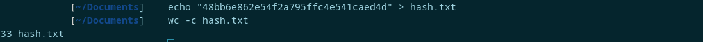

With the format identified, I used hashcat with mode `0` and the `rockyou.txt` wordlist:

```bash
hashcat -m 0 hash.txt /usr/share/wordlists/SecLists/Passwords/Leaked-Databases/rockyou.txt
```


The hash was cracked immediately, revealing the plaintext value.

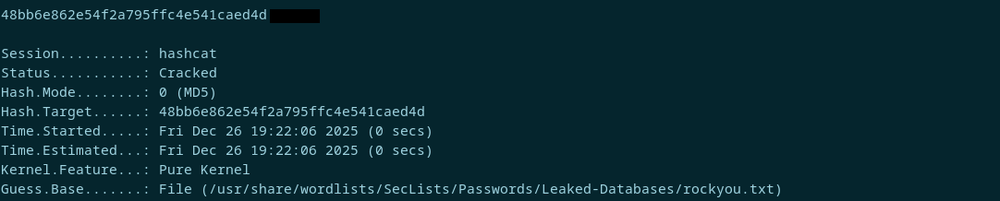

##### hash 2

`CBFDAC6008F9CAB4083784CBD1874F76618D2A97 `

I replaced the previous hash in `hash.txt` and again used `wc -c` to determine its length.      
The output returned `42` characters, which corresponds to a 40‑character `SHA‑1` hash plus newline. Based on this, I proceeded using the `SHA‑1` format.

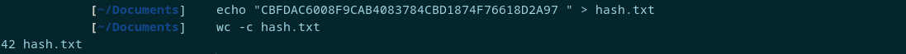

With the hash type identified, I used hashcat in mode `100` together with the `rockyou.txt` wordlist:

```bash
hashcat -m 100 hash.txt /usr/share/wordlists/SecLists/Passwords/Leaked-Databases/rockyou.txt
```


The plaintext was obtained without issue.

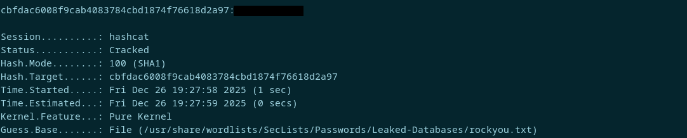

##### hash 3

`1C8BFE8F801D79745C4631D09FFF36C82AA37FC4CCE4FC946683D7B336B63032`

After replacing the previous value in `hash.txt`, I checked the length of the new hash.     
The output showed `65` characters, which corresponds to a 64‑character `SHA‑256` hash plus newline. Based on this, I proceeded using the `SHA‑256` format.

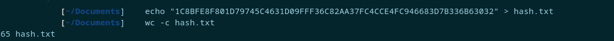

To crack it, I used hashcat in mode `1400` with the `rockyou.txt` wordlist:

```bash
hashcat -m 1400 hash.txt /usr/share/wordlists/SecLists/Passwords/Leaked-Databases/rockyou.txt
```


The plaintext was recovered immediately.

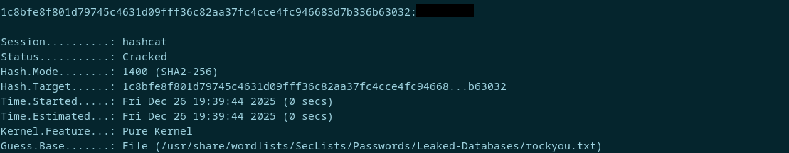

##### hash 4

`$2y$12$Dwt1BZj6pcyc3Dy1FWZ5ieeUznr71EeNkJkUlypTsgbX1H68wsRom`

This hash could not be reliably identified by length alone, so I compared its structure against the formats listed in the [Hashcat example database](https://hashcat.net/wiki/doku.php?id=example_hashes). The prefix `$2y$12$` matched the format used by `bcrypt`, a deliberately slow hashing algorithm designed to resist brute‑force attacks.

The challenge description indicates that the expected answer consists of four characters `****`.        
Since all answers in this level are known to appear in `rockyou.txt`, I created a reduced wordlist containing only entries of length four. This was done using:

```bash
awk 'length($0)==4' /usr/share/wordlists/SecLists/Passwords/Leaked-Databases/rockyou.txt > rockyou-4.txt
```

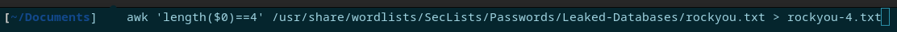

With the filtered list prepared, I used hashcat in mode `3200` to attempt the crack:

```bash
hashcat -m 3200 hash.txt rockyou-4.txt
```

The reduced wordlist significantly improved performance, and the plaintext was recovered in approximately one minute.

      
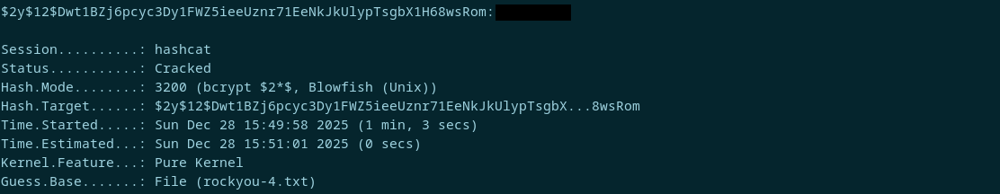

##### hash 5

`279412f945939ba78ce0758d3fd83daa`

After adding the hash to `hash.txt`, I checked its length using `wc -c`.
The output showed `33` characters, which is consistent with a 32‑character hash plus newline. However, treating it as `MD5` did not produce a result.

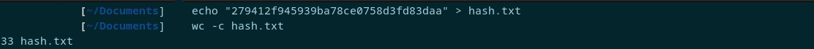

Since the format was not immediately identifiable by length alone, I used an [online hash‑type identifier](https://www.dcode.fr/cipher-identifier) to compare its structure. This confirmed the correct hash type.

The plaintext result shown by the tool was ignored for the purpose of the challenge.

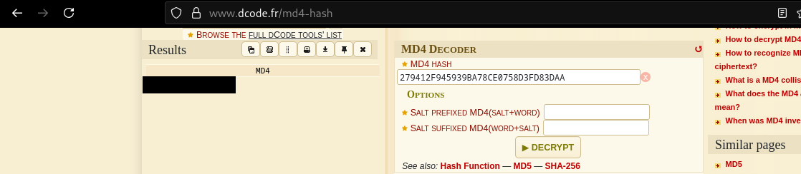

With the format identified, I proceeded to crack it using hashcat in the appropriate mode. I also applied the best64 rule set.

```bash
hashcat -m 900 hash.txt /usr/share/wordlists/SecLists/Passwords/Leaked-Databases/rockyou.txt -r /usr/share/hashcat/rules/best64.rule
```

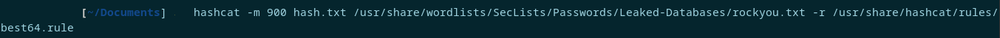

The hash was successfully cracked using this approach.

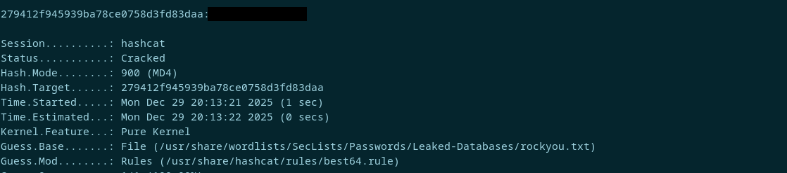

#### Level 2

##### hash 1

`F09EDCB1FCEFC6DFB23DC3505A882655FF77375ED8AA2D1C13F640FCCC2D0C85`

Once again I used acho to inject the hash into `hash.txt` and count the (chars? bits? wharever wc -c counts), coming with a result of  65, that refered to SHA-256


I echoed the hash to `hash.txt` and checked its length using `wc -c`.
The output showed 65 characters, which corresponds to a 64‑character `SHA‑256` hash plus newline. Based on this, I proceeded using the `SHA‑256` format.

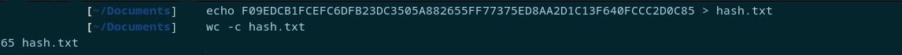

To crack it, I used hashcat in mode `1400` with the `rockyou.txt` wordlist.

```bash
hashcat -m 1400 hash.txt /usr/share/wordlists/SecLists/Passwords/Leaked-Databases/rockyou.txt
```


The plaintext was recovered immediately.

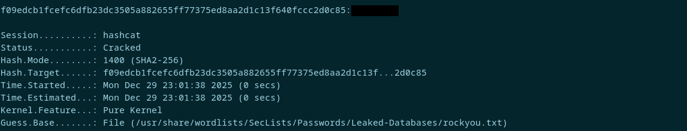

##### hash 2

`1DFECA0C002AE40B8619ECF94819CC1B`

After adding the hash to `hash.txt`, I ran `wc -c` on it and got 33 characters.     
That length fits a few different hash types, so I looked at the character range and overall structure. It lined up with what `NTLM` hashes usually look like, so I decided to try that first.

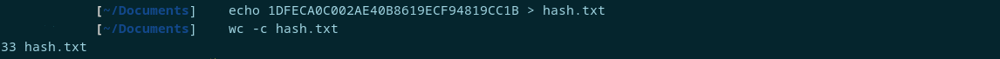

To crack it, I used hashcat in mode `1000` with the `rockyou.txt` wordlist.

```bash
hashcat -m 1000 hash.txt /usr/share/wordlists/SecLists/Passwords/Leaked-Databases/rockyou.txt
```


And the plaintext was recovered successfully.

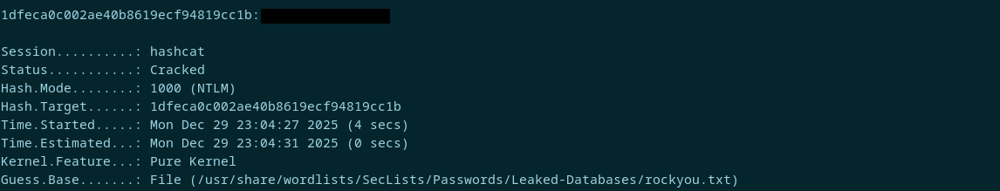

##### hash 3

`$6$aReallyHardSalt$6WKUTqzq.UQQmrm0p/T7MPpMbGNnzXPMAXi4bJMl9be.cfi3/qxIf.hsGpS41BqMhSrHVXgMpdjS6xeKZAs02`

This one stood out immediately because it actually includes a salt in the hash string.      
Looking it up, I found that the `$6$` prefix means it’s a `SHA‑512` hash. These tend to take a lot longer to crack, especially when a salt is involved.

Since the answer for this challenge is shown as `******`, I assumed it was a 6‑character password.

To speed things up, I created a filtered version of the rockyou list containing only 6‑character entries.

```bash
awk 'length($0)==6' /usr/share/wordlists/SecLists/Passwords/Leaked-Databases/rockyou.txt > rockyou-6.txt
```

I then copied the hash into hash.txt using `Vim`, since `echo` didn’t behave correctly with this format.

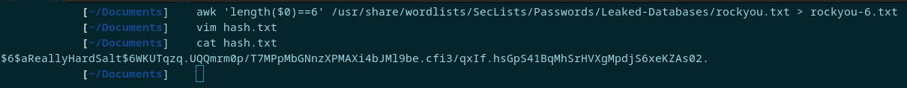

With everything ready, I ran Hashcat in mode `1800` against the reduced wordlist.

```bash
hashcat -m 1800 hash.txt rockyou-6.txt
```


and after roughly 19 minutes (this was the longest one to crack!!) i got the password! (would be way worse if i used the complete rockyou!!)

After about 19 minutes (easily the longest crack so far) it finally returned the password.      
Using the full rockyou list would have taken much longer.

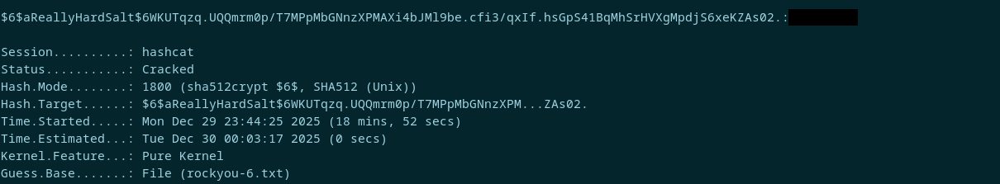

##### hash 4

`e5d8870e5bdd26602cab8dbe07a942c8669e56d6`

Salt: `tryhackme`

This hash was a bit different because the salt isn’t included directly in the hash string. That means the format Hashcat expects is `hash:salt`, so I opened `Vim` and wrote it in that format inside `hash.txt`.

From the structure and the fact that it uses an external salt, I found out this corresponds to `HMAC‑SHA1`.

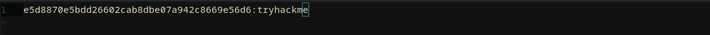

With the hash and salt stored correctly, I ran Hashcat in mode `160` using the `rockyou` wordlist.

```bash
hashcat -m 160 hash.txt /usr/share/wordlists/SecLists/Passwords/Leaked-Databases/rockyou.txt
```

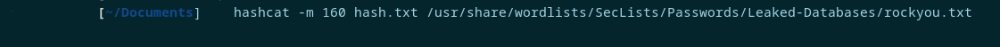

It cracked in about 9 seconds, which wrapped up the room.

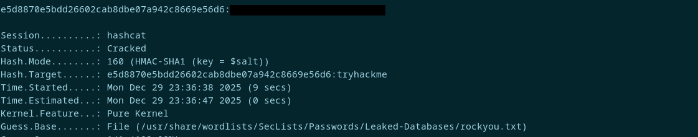

---