# Room: [Kenobi](https://tryhackme.com/room/kenobi)

## Overview
This write‑up covers the *Kenobi* room on [TryHackMe](https://tryhackme.com), created by [tryhackme](https://tryhackme.com/p/tryhackme).

The objective of this room is to gain root access to a machine by using enumeration techniques, vulnerability exploitation, and path hijacking.


## Setup
- **Tools used:** `nmap`, `enum4linux`, `netcat`, `searchploit`
- **Techniques:** SMB share enumeration, ProFTPD mod_copy abuse, path hijacking.
- **Notes:** This room is structured as a walkthrough, but I documented my own process, including alternative commands that achieve the same results. All answers are redacted.

---

## Methodology

### Task 1 - Deploying Machine

I began by running a basic network scan with nmap to identify the open ports on the target.

```bash
nmap <Target IP>
```

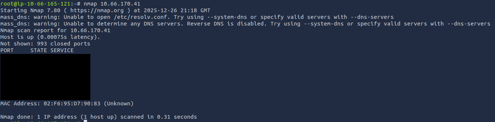

### Task 2 - Enumerating Samba

The scan confirms the presence of an SMB service on the target, and the room suggests enumerating the available shares using the following nmap script:

```bash
nmap -p 445 --script=smb-enum-shares.nse,smb-enum-users.nse <Target IP>
```

But instead, I used `enum4linux`.

```bash
enum4linux -S <Target IP>
```

This produced the following output:

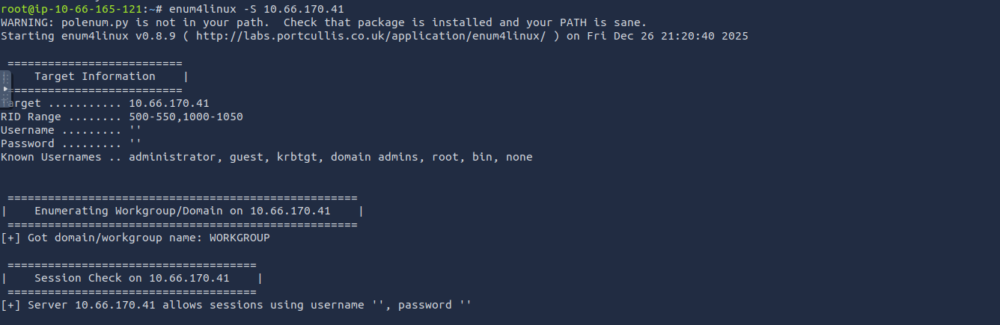

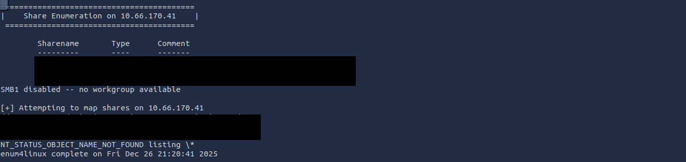

The scan shows that the user `anonymous` is allowed to authenticate without a password.

The next step is to connect to the share:

```bash
smbclient //<Target IP>/anonymous
```

Authentication succeeds, and the files on the share can be listed.

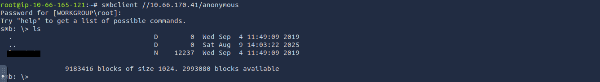

The contents of the share can be downloaded recursively using:

```bash
smbget -R smb://<Target IP>/anonymous
```

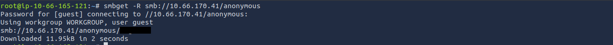

The file can then be viewed with `cat` as shown below.

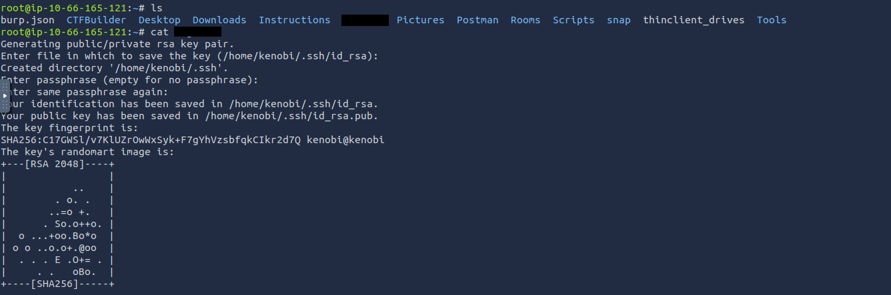  
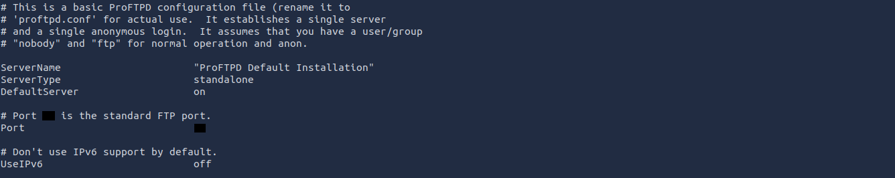

The next step focuses on `port 111`, previously identified during the initial scan.

The room uses the following script to gather additional information:

```bash
nmap -p 111 --script=nfs-ls,nfs-statfs,nfs-showmount <Target IP>
```

I tested several variations and found that the following command is sufficient to answer the task’s question:

```bash
nmap -p 111 --script=nfs-showmount <Target IP>
```

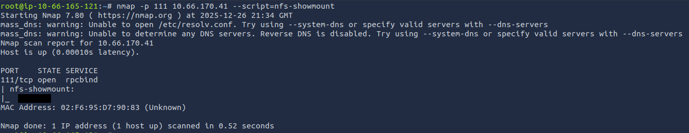

### Task 3 - Gaining access with ProFtpd

To identify the ProFTPD version running on the target, I connected to the service using:

```bash
nc <Target IP> <FTP Port>
```

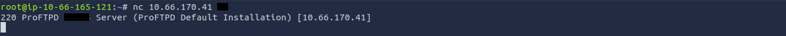

With the version obtained, the next step is to search for related vulnerabilities using `searchsploit`:

```bash
searchploit proftpd <Service Version>
```

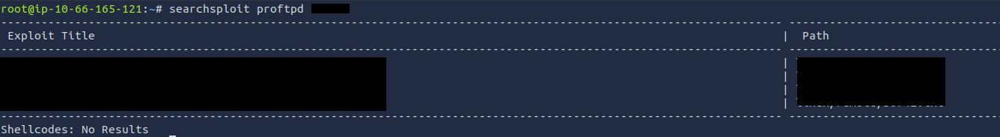

This returns several results, including the one referenced in the room’s instructions.

Using the `SITE CPFR` and `SITE CPTO` commands, the private key for the user on the target is copied to a directory previously identified as a mount point under `/tmp`.


The directory is then mounted locally using the commands provided in the room.

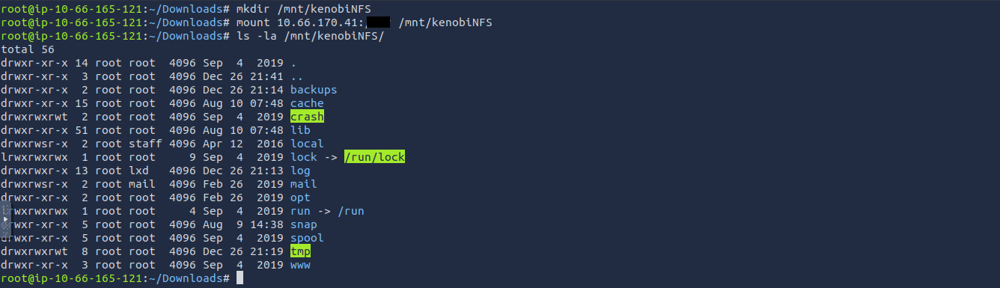

With the network share mounted, the private key can be accessed from the mounted directory and copied for authentication into the target user’s account, allowing retrieval of the user flag.

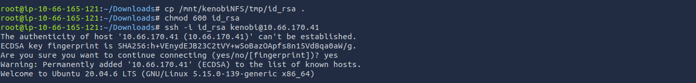

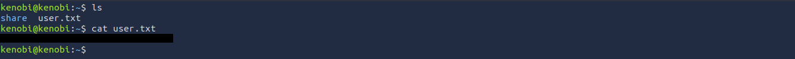

### Task 4 - Escalating Priviledges

This task begins by searching for binaries with the `SUID` bit set using the provided command:

```bash
find / -perm -u=s -type f 2>/dev/null
```

Among the results, one entry stands out.

Running this binary and inspecting it with `strings` reveals a call to `curl` without an absolute path.

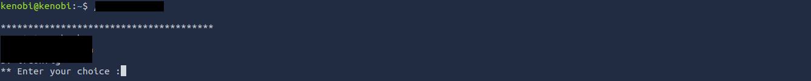

To locate the relevant line quickly:

```bash
strings <Binary Name> | grep curl
```


With this confirmed, the path is modified to introduce a custom `curl` executable in the current directory.     
This replacement script spawns a shell when executed.       

After exporting the modified path and running the `SUID` binary, root access is obtained.

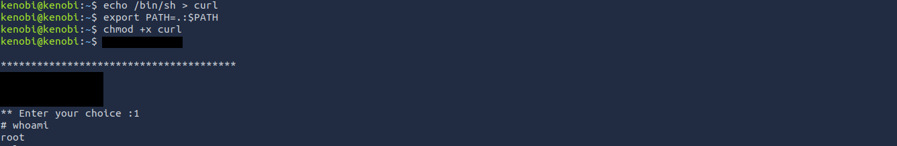

With elevated privileges, the root flag can be retrieved.

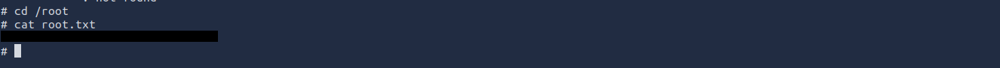


---
