# Room: [Soupedecode 01](https://tryhackme.com/room/soupedecode01)

## Overview
This write‑up covers the *Soupedecode 01* room on [TryHackMe](https://tryhackme.com), created by [tryhackme](https://tryhackme.com/p/tryhackme) and [josemlwdf](https://tryhackme.com/p/josemlwdf).

The objective of this room is to enumerate an Active Directory environment, identify misconfigurations, and escalate privileges to compromise the domain controller.

## Setup
- **Tools used:** `nmap`,`netexec`,`hashcat`,`impacket`
- **Techniques:** `smb user and share enumeration`, `RID cycling`, `password spraying`,`kerberoasting`, `hash cracking`, `pass-the-hash`
- **Notes:** I’ve been getting more comfortable with Linux‑based machines, so I decided it was time to tackle a Windows/Active Directory target. It turned out to be a great learning experience.

---

## Methodology

#### Enumeration

Since I worked on this machine across multiple sessions, I started by defining a `TARGET` environment variable to store the target machine’s IP address. This keeps commands consistent and reduces the chance of typos during enumeration.


```bash
export TARGET=<Target IP>
```

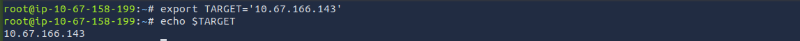

Then I began the initial enumeration phase by running a basic `nmap` scan against the target.       
This provided a quick overview of the exposed services and confirmed that several ports were open.


```bash
nmap $TARGET
```

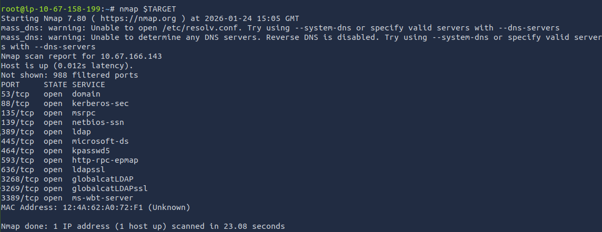

I wanted to experiment a bit with `nmap` before diving deeper into service‑specific enumeration, so I followed up with a full port scan to compare the results.


```bash
nmap -p- $TARGET -Pn
```

This scan probes all 65,535 `TCP` ports and skips host discovery.     
In this case, it revealed additional open ports that didn’t appear in the initial default scan, including several listed as “unknown”.

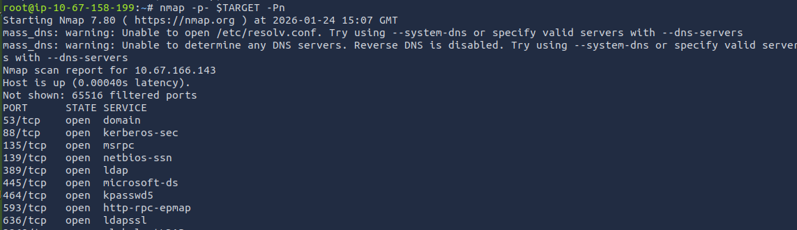   
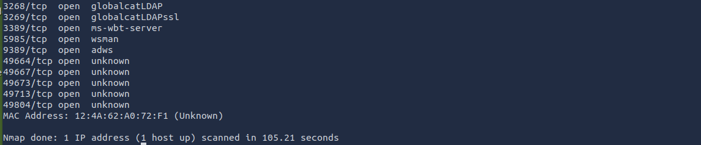

After the full port scan revealed additional services, I used its results to run a final targeted enumeration pass.

This time, I included service/version detection and default NSE scripts to gather as much detail as possible, since a webpage was not available on this machine.

```bash
nmap -sVC -p 53,88,135,139,189,445,464,593,636,3268,3269,3389,5985,9389,5985,9389,49664,49667,49673,49113,49804 $TARGET -Pn
```

This scan provided a clearer picture of the environment.

From the output, several key details became apparent:

* The host is a domain controller.

* The FQDN appears as DC01.SOUPEDECODE.LOCAL, meaning: 

    * The hostname is `DC01`.

    * The domain name is `SOUPEDECODE.LOCAL`.

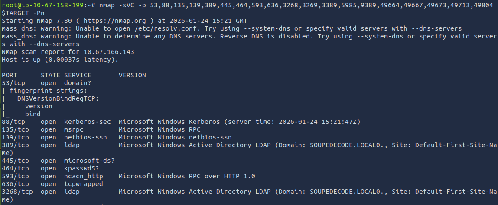   
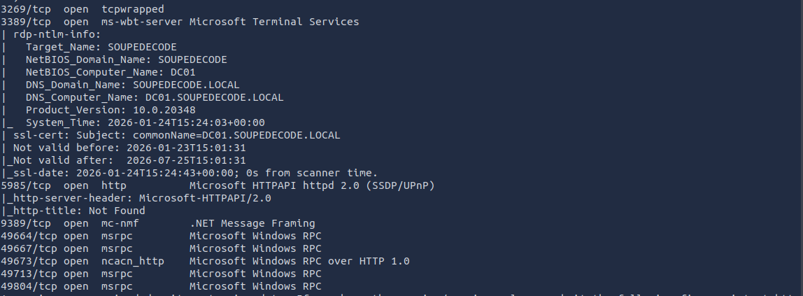     
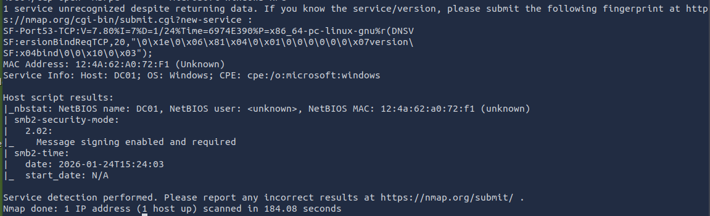

For convenience during enumeration, I added entries for `DC01.SOUPEDECODE.LOCAL` and `SOUPEDECODE.LOCAL` to my `/etc/hosts` file, mapping both to the target’s IP address.

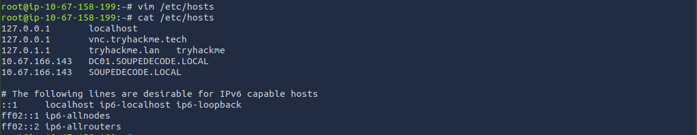

Next, based on the open ports identified earlier, I noticed that `SMB` was available on `port 445`, and since anonymous access is sometimes enabled on misconfigured domain controllers, I tested a guest login using netexec.

```bash
nxc smb <Domain Name> -u guest -p ''
```

The login was successful, confirming that the SMB service allowed unauthenticated guest access.

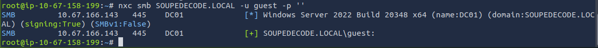

Since the guest account was available without a password, I used netexec again to enumerate its `SMB` shares.

```bash
nxc smb <Domain Name> -u guest -p '' --shares
```

The output showed that the guest account had read access to the `IPC$` share.

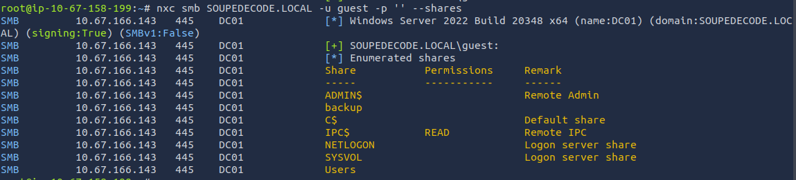

And since the `--rid` option was available to the guest account, I used it to enumerate domain users. 

```bash
nxc smb <Domain Name> -u guest -p '' --rid >> nxc-cmd.txt
```

The output was quite long, so I redirected it into a file that I named `nxc-cmd.txt` for easier review and processing.

Afterward, I checked the file structure to confirm the output was captured correctly.

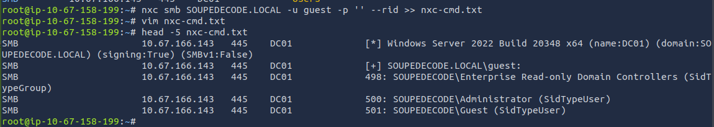

To get an idea of the scale of the output, I used `wc -l` to count how many lines were written to the file.     
The result was… a lot.

Finally, to better understand the structure of the data and identify what actually constitutes a valid user entry, I used `head` to inspect the first few lines of the file.

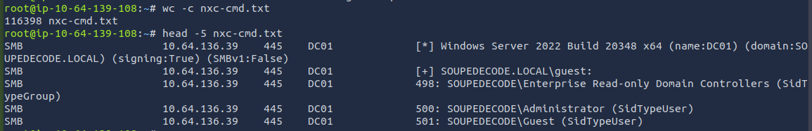

To reduce the massive list generated by the `RID cycling`, I wrote a small [Python script](https://github.com/Inv4riant/tryhackme-writeups/blob/main/Easy/Soupedecode%2001/username.py) to parse `nxc-cmd.txt` and extract only entries that match the structure of valid domain usernames. The script filtered out noise, machine accounts, and malformed lines, producing a clean `usernames.txt` file.

This ended up reducing the list from 116,398 entries down to 968 valid usernames.

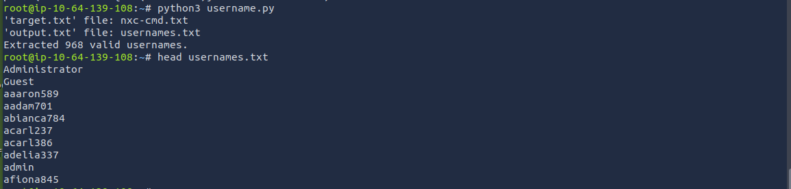

#### Initial Access

Using the cleaned `usernames.txt` file as both the username list and the password list, I began a password‑spraying attempt to check for accounts where the username is also used as the password.

I used netexec again for this step.

```bash
nxc smb $TARGET -u usernames.txt -p usernames.txt --no-bruteforce | grep -v FAILIURE
```

Despite the large number of accounts, I was able to identify one user whose password matched their username.

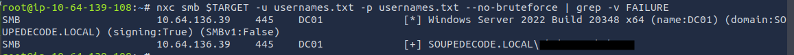

With valid user credentials, I enumerated the SMB shares available to the user's account.

```bash
nxc smb $TARGET -u <username> -p <username> --shares
```

The user had read access to the following shares:

* IPC$ -> previously seen; used for remote management and enumeration.

* NETLOGON -> commonly accessible to authenticated users.

* SYSVOL -> also typically readable.

* Users -> this one stood out, as it often contains home directories or user‑specific data.

The presence of `Users` with read access made it a target for further exploration.

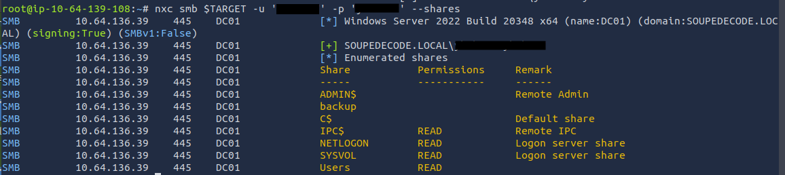

With access to the `Users` share, I connected to it using smbclient to explore the directory structure and check whether any user‑specific data was accessible.

```bash
smbclient //$TARGET/Users -U SOUPEDECODE.LOCAL/<username>
```

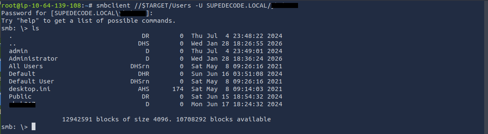

Once inside, I browsed through the available folders.       
Nothing particularly sensitive stood out, but I was able to retrieve the user flag from the corresponding home directory.

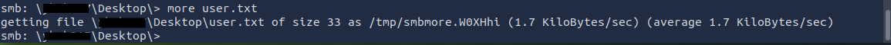

#### Exploitation

With nothing else of value exposed through SMB, I moved on to Kerberoasting.

Since I now had valid domain credentials, I could request service tickets for any SPN‑configured accounts and extract their encrypted material for offline cracking.

```bash
nxc ldap $TARGET -u <username> -p <username> --kerberoasting khash.txt
```

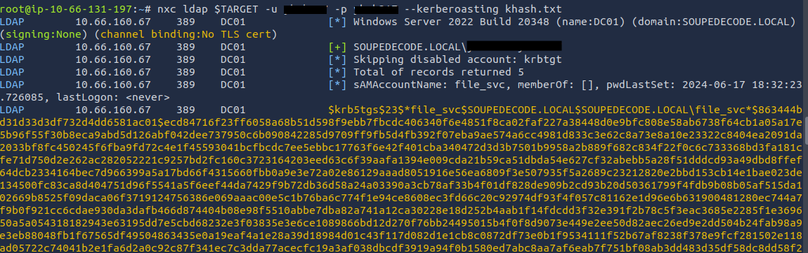

With the Kerberos service ticket saved in `khash.txt`, I moved on to offline cracking.

The ticket contained encrypted material for some service accounts and I used `hashcat` and the `rockyou.txt` wordlist to try to crack them.

```bash
hashcat -m 13100 khash.txt /usr/share/wordlists/rockyou.txt
```

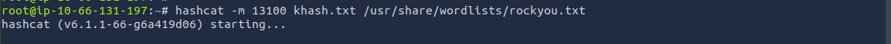

Luckily one of the hashes was sucessfully cracked and I retrieved the `file_svc` account's password.

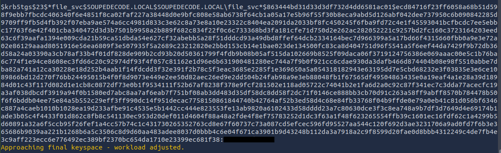

With the newly cracked credentials, I enumerated `file_svc`'s `SMB` shares to see whether this account had access to anything the previous user couldn’t.

```bash
nxc smb $TARGET -u file_svc -p <file_svc's password> --shares
```

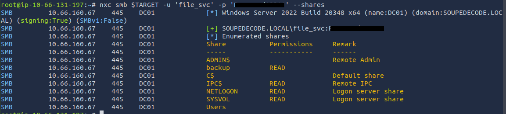

In addition to the shares already accessible before, this account also had read access to the `backup` share, so I decided to check it out.

```bash
smbclient //$TARGET/backup -U file_svc
```

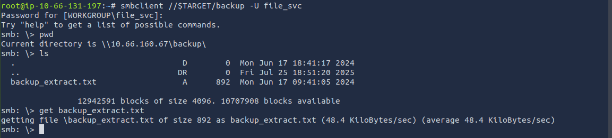

Digging into the `backup` share paid off.     
`backup_extract.txt` conveniently contained machine account data from the domain, including their corresponding password hashes.

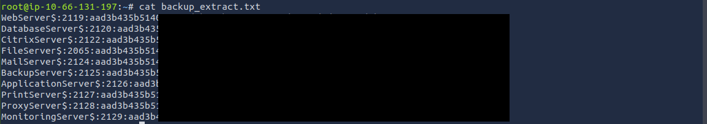

I used `cut` to extract the machine account names and their corresponding hashes into two separate files.

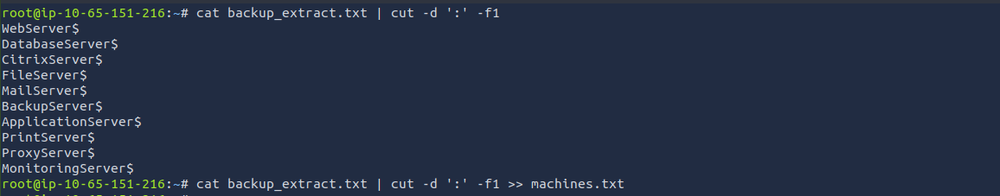  
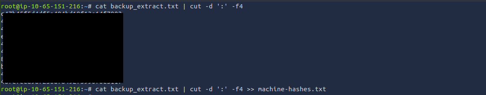

With the machine account names and hashes extracted, I attempted authentication using pass‑the‑hash.

```bash
nxc smb $TARGET -u machines.txt -p machine-hashes.txt --no-bruteforce
```

And got a hit for the `FileServer$` machine account.

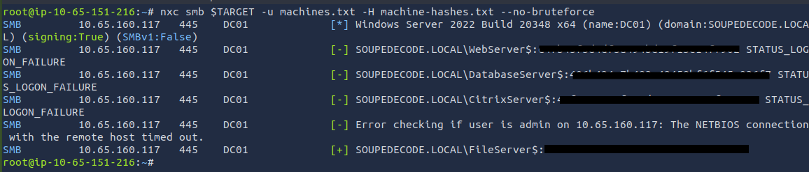

Now with valid credentials for the `FileServer$` account, I enumerated its `SMB` shares to determine what level of access I now had.

```bash
nxc smb $TARGET -u FileServer -p <hash> --shares
```

It just so happens that this account had read and write access to the `C$`share. 

Write access to `C$` is a great setup for lateral movement or full system compromise.

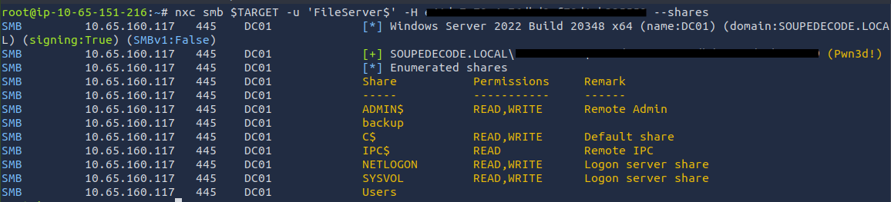

#### Privilege Escalation

After some research, I decided to use `Impacket’s psexec.py`, which creates a service on the target system and spawns a SYSTEM‑level shell if the provided credentials are valid.

```bash
python3 /opt/impacket/examples/psexec.py 'SOUPEDECODE.LOCAL/FileServer$'@$TARGET -hashes :<hash>
```

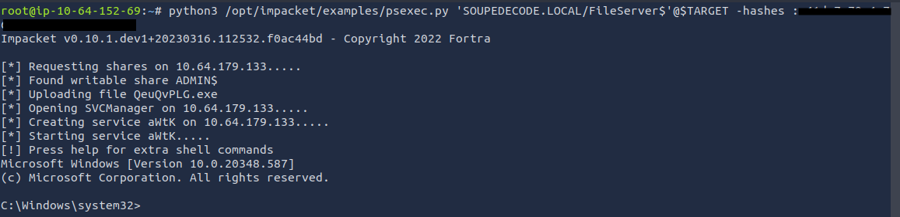

I was then able to navigate to `C:/Users/Administrator/Desktop` and retrieve the root flag.

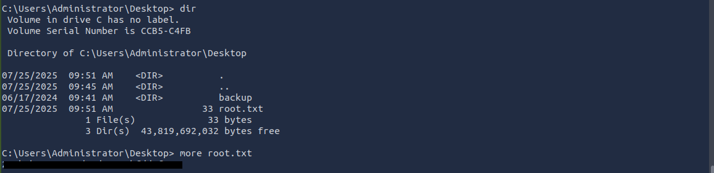

To confirm the level of access, I checked the current user, and as expected, the shell was running as `NT AUTHORITY\SYSTEM`, giving me full control over the machine.

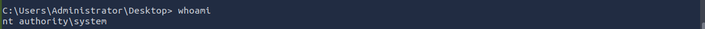

---

