# Room: [Anonymous Playground](https://tryhackme.com/room/anonymousplayground)

## Overview
This write‑up covers the *Anonymous Playground* room on [TryHackMe](https://tryhackme.com), created by [Nameless0ne](https://tryhackme.com/p/Nameless0ne).

The objective of this room is to compromise the machine behind an anonymous‑style website, escalate privileges, and ultimately obtain root access.

## Setup
- **Tools used:** `nmap`,`gobuster`,`radare2`
- **Techniques:** `fuzzing`, `session hijacking`, `binary exploitation`, `abusing tar.gz with --checkpoint`
- **Notes:**  This was my first hard‑difficulty room. It was challenging but genuinely rewarding, especially the binary exploitation and assembly‑related parts. Learned a lot from this one.

---

## Methodology

#### Enumeration

I began with a basic `nmap` scan against the target:

```bash
nmap <Target IP>
```

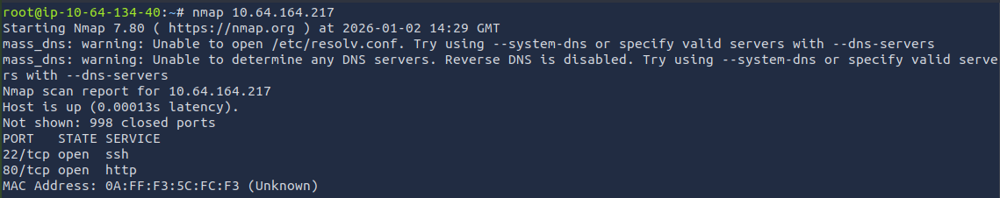

The scan revealed two open ports: `SSH (22)` and `HTTP (80)`.

With a web server exposed, the next logical step was to browse to `http://<Target IP>` and explore the site manually; Checking each page, interacting with the available menus, and reviewing the source code.

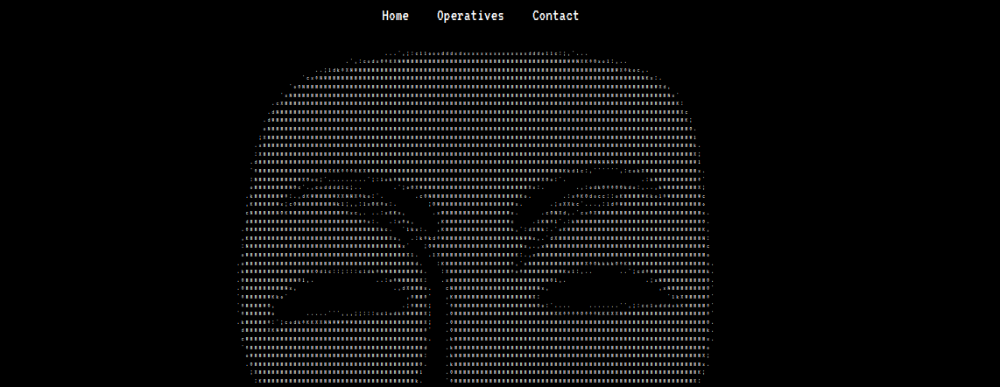

Nothing immediately useful stood out, so I moved on to directory enumeration. I used `gobuster` with the `big.txt` wordlist to search for hidden paths.

```bash
gobuster -dir -u <Target IP> -w /usr/share/wordlists/dirb/big.txt
```

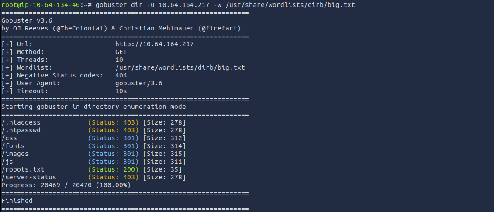

The directory enumeration revealed a `robots.txt` file, so I checked it for any clues.

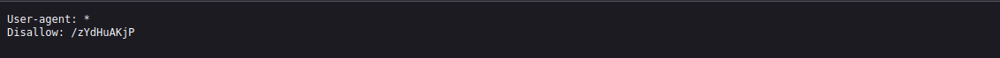

The clue revealed another secret directory that could be accessed with the name `/zYdHuAKjP` so i went and navigated to it

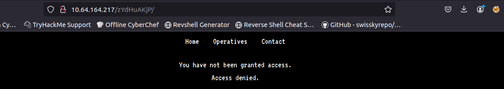

Inside, there was a reference to a hidden path: `/zYdHuAKjP`. Navigating to that directory led to an access‑denied page.

After inspecting the page more closely, I noticed a session cookie under the browser’s storage tab. Its value was set to `denied`, and since it was editable, I changed it to `granted`.

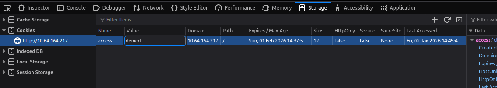

Updating the cookie granted access to the hidden page. A message appeared, congratulating me for reaching that point, followed by what initially looked like random text.

The hint for this flag was: `zA = 'a'`. This suggested that the text was encoded using a custom cipher where each pair of characters determines how the second character is shifted based on the first.

The cipher can be decoded using a small [python script]().


#### Foothold

After decoding the message, I obtained valid SSH credentials for the `magna` user and logged into the machine.

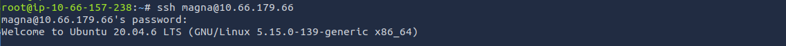

Inside the home directory, I retrieved the user flag.

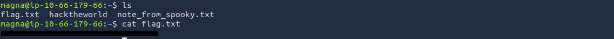

The same directory also contained a text file named `note_from_spooky` and a binary called `hacktheworld`. I checked the note first to see if it contained any hints.

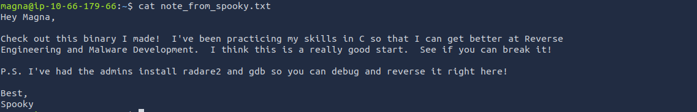

The note provides a clear hint about the next step in the exploitation chain, we need to analyze and exploit the binary left behind by spooky, which is also owned by that user. It also mentions that the necessary tools, gdb and radare2, are already installed on the system.

Before diving into either debugger, I ran the binary through `strings` to look for anything interesting that might reveal how it behaves or what it expects.

Amidst the Anonymous‑style text, the line `/bin/bash` stood out. This strongly suggests that the program attempts to spawn a shell at some point, and since it’s owned by spooky, that immediately hints at a potential privilege escalation path if we can control the program’s execution flow.

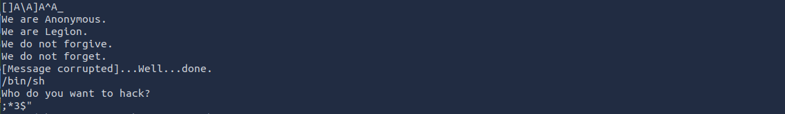

#### Privilege Escalation
##### magna -> spooky

Once inside, I ran the initial analysis command `aaa`.      
This performs a full analysis of the binary and prepares the environment so functions, references, and symbols can be inspected properly.

Next, I listed all discovered functions using: `afl`.       
This produced a list of functions present in the program. Near the end of the output, `sym.call_bash` caught my attention.

This confirmed that the binary contains a function explicitly designed to spawn a shell.

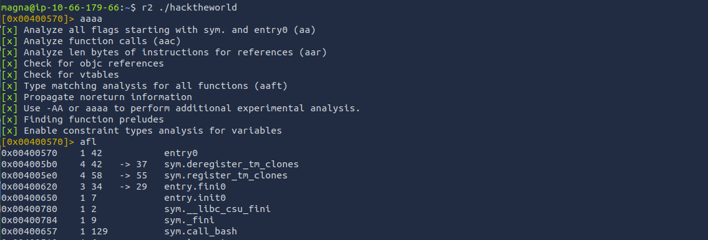

After identifying sym.call_bash in the function list, I inspected it directly:

```
s sym.call_bash
```

This displayed the function in assembly. One sequence in particular confirmed what I suspected earlier — the binary attempts to spawn a shell.

The presence of `setuid` followed by a call to `system("/bin/sh")` makes it clear that triggering this function would give us a shell running with spooky’s privileges.

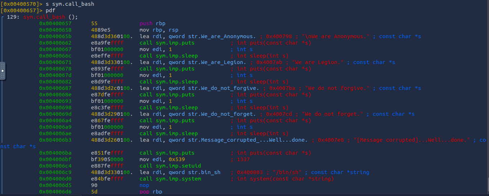

Next, I needed to determine whether this function was referenced anywhere else in the program. I checked for cross‑references using:

```
axt sym.call_bash
```

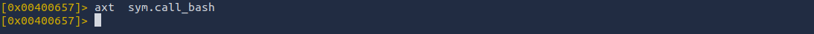

No output was returned, meaning nothing in the binary calls this function directly. That left only one option, to find a way to redirect execution to it manually.

To understand how execution flows normally, I examined the `main` function. While reviewing it, I noticed that `main` accepts user input without performing any bounds checking and eventually returns.

At this point, the path forward was to exploit the overflow, overwrite the return address, and redirect execution to `sym.call_bash`.

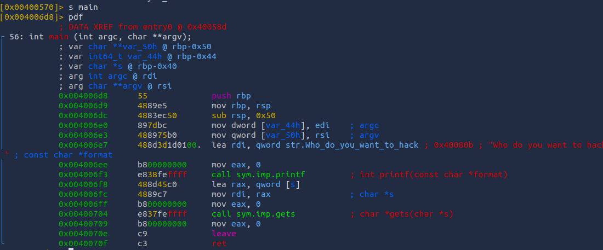

To identify where the program began overwriting the saved return information, I used a binary‑search‑style narrowing approach rather than testing every length sequentially. I started with a large input (100 characters), saw it caused a crash, then tried a much smaller value (50), which worked.      
From there, I kept adjusting the range until I isolated the exact point where the program stopped behaving normally.


```bash
python -c 'print "Y"*n' | ./hacktheworld
```

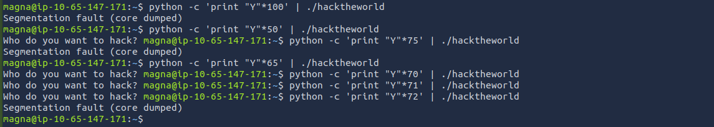

Using this method, I determined that the program began overwriting the saved return pointer after `72 bytes`. Anything beyond that offset affected the program’s control flow.

To trigger the intended behavior, I sent 72 filler characters followed by the target address in the correct byte order and used `cat` to keep the program’s input stream open.

```bash
(python -c 'print "Y"*72 + "\x58\x06\x40\x00\x00\x00\x00"' ; cat) | ./hacktheworld
```

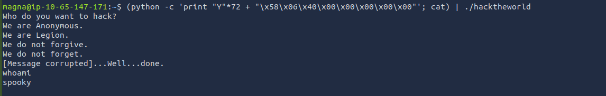

I looked around until i decided to `/etc/crontab` and noticed an entry running as root that went to spooky's home dir (via cd) and compacted /var/backups/spooky.tgz (the cronjob: */1 * * * * cd /home/spooky && tar -zcf /var/backups/spooky.tgz * )

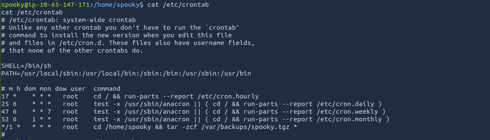

##### spooky -> root

After escalating to the user spooky, I explored the system and eventually checked `/etc/crontab` and noticed one particular job that ran as root every minute, changing into spooky’s home directory and creating a compressed archive in `/var/backups`

The cron job was invoking tar as root inside a directory I controlled. That meant I could influence how tar behaved and to take advantage of this, I created a small script called willigetroot.sh that attempted to modify the sudoers file so spooky would be allowed to run commands as root without a password.

```bash
echo 'echo "spooky ALL=(root) NOPASSWD: ALL" > /etc/sudoers' > willigetroot.sh
```

Next, I created a specially named file intended to make tar interpret it as an instruction rather than a normal filename.

```bash
echo " " > "--checkpont-action=exec=sh willigetroot.sh"
```

I also created another file used by tar’s checkpoint mechanism.

```bash
echo " " > --checkpoint=1
```

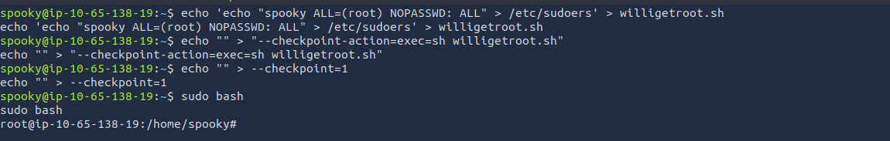

With these files in place, I waited for the cron job to run and tested the result by running `sudo bash`.

This successfully opened a root shell, allowing me to access the final flag in `/root`.

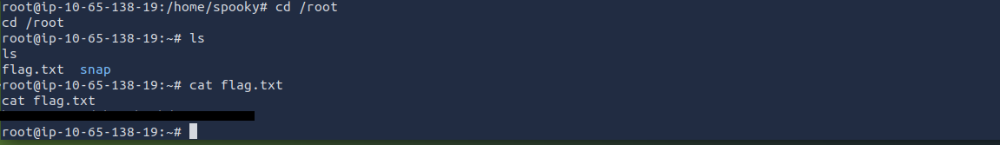

---