# Room: [Mr Robot CTF](https://tryhackme.com/room/mrrobot)

## Overview
This write‑up covers the *Mr Robot CTF* room on [TryHackMe](https://tryhackme.com), created by [ben](https://tryhackme.com/p/ben) and [tryhackme](https://tryhackme.com/p/tryhackme).

The objective of this room is straightforward and consistent with the challenges I usually pick: obtain full system compromise and achieve root access.

## Setup
- **Tools used:** `nmap`,`gobuster`,`burp suite`,`hydra`,`hashcat`
- **Techniques:** `HTTP request capture`, `credential brute-forcing`, `remote code execution`, `hash cracking`, `SUID abuse`

- **Notes:**  The room ran quite slowly at times, which made the process a bit more tedious than expected, but the challenge itself was solid and fun to work through. IP addresses vary throughout the write‑up due to multiple resets.

---

## Methodology

#### Enumeration

I began with a basic port scan using `nmap`.

```bash
nmap <Target IP>
```

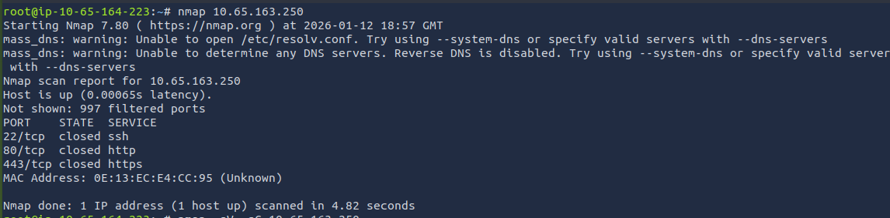

The scan identified three ports: `22 (SSH)`, `80 (HTTP)`, and `443 (HTTPS)`, but all of them were closed.

Since this can happen on first attempts or depending on timing, I followed up with a more thorough scan.

```bash
nmap -sV -sC <Target IP>
```

This time the ports were open and service detection returned additional details. I didn’t end up needing most of this information for the solve, which is why I usually start with simpler scans first and only escalate if necessary.

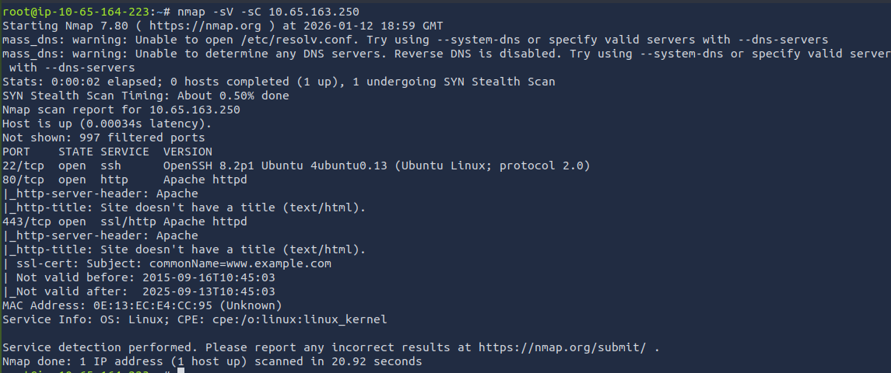

Seeing that `port 80` was available, I moved on to exploring the website.

The landing page was dynamic and presented a message along with an interactive, terminal‑style interface where commands could be typed.

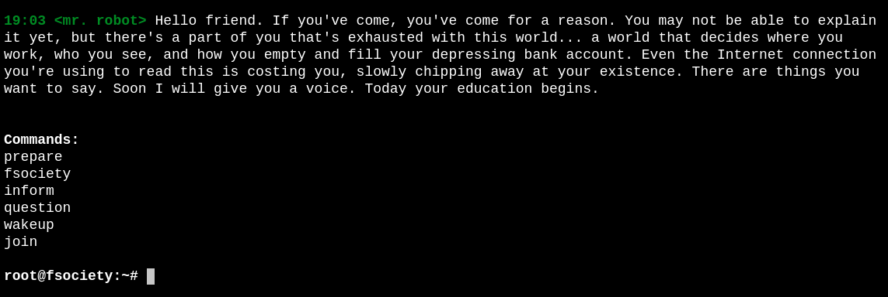

I tried every command. Each one played a video or showed an image before returning to the main interface, and `help` listed the available options. As nice as the interface was, it didn’t offer anything that helped advance the challenge.

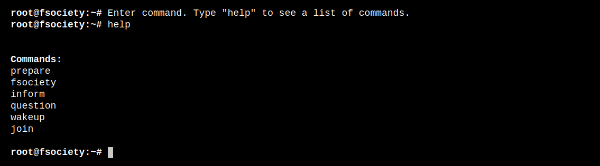

So I moved on to directory enumeration using gobuster.

I began with a simple scan, which returned a large number of results.       
To make the output more manageable, I filtered my attention to entries returning `HTTP status code 200`, meaning the page exists and responded successfully.

```bash
gobuster dir -u <Target IP> -w /usr/share/wordlists/dirb/common.txt -s "200" -b ""
```

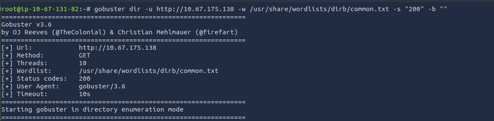      
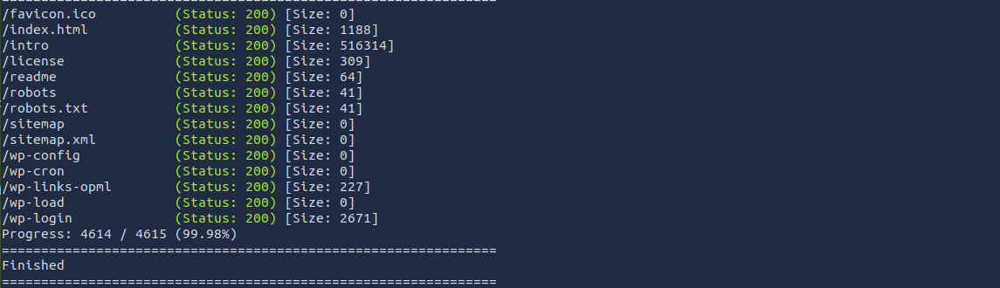

Then, I started checking the discovered paths.        
I looked through most of them, though only a few contained anything relevant.

Visiting `/readme` produced the following message:

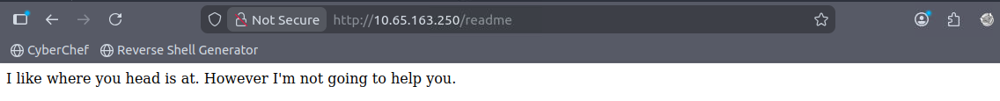

And `/license` returned this:

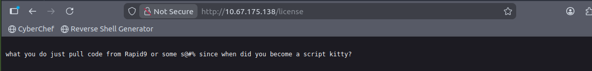       
      
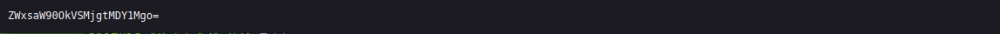

This page exposed a Base64‑encoded string that I ran it through CyberChef, which correctly decoded it.

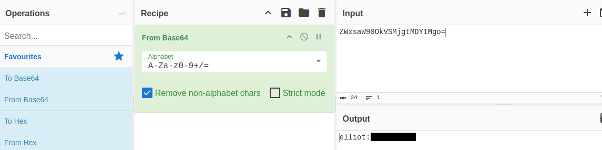

The decoded value revealed elliot’s credentials. I chose not to use them, partly because this was clearly the “easy way in,” and partly because I knew there was a more proper exploitation path I wanted to learn.

So I continued exploring the discovered directories and eventually reached `/robots.txt`.

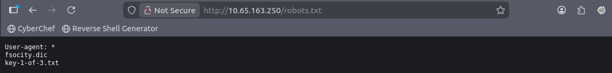

The first thing that stood out in `robots.txt` was the first flag, which was accessible by appending the path directly to the URL.

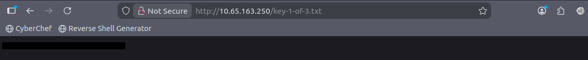

The file also referenced `fsocity.dic`, which appeared to be a wordlist. 

I downloaded it to my machine using `wget` for further inspection, and a quick check with `wc -c` confirmed it was indeed a dictionary file, a long and very messy one.

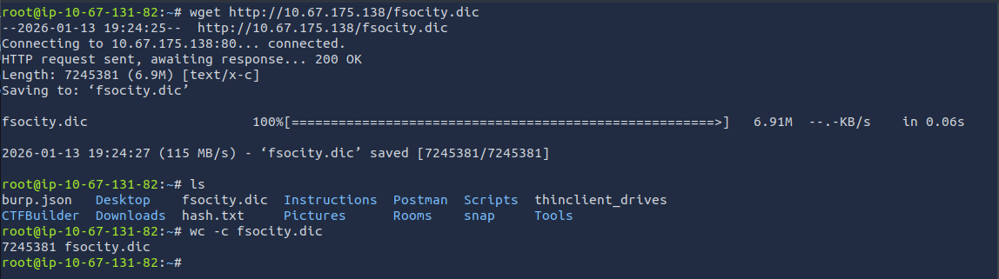

To make it more usable, I decided to clean and organize the list.       
I used:

```bash
sort fsocity.dic | uniq > sorted.dic
```

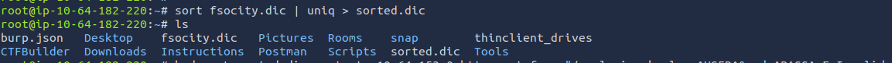

After sorting, the file became significantly smaller, which meant it would be much faster to use for brute‑forcing or any other wordlist‑based attack.

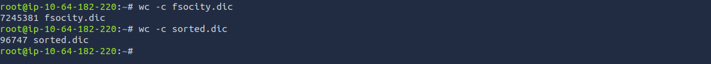

With that done, I continued exploring the directories discovered by `Gobuster` and eventually found a `WordPress login page`.

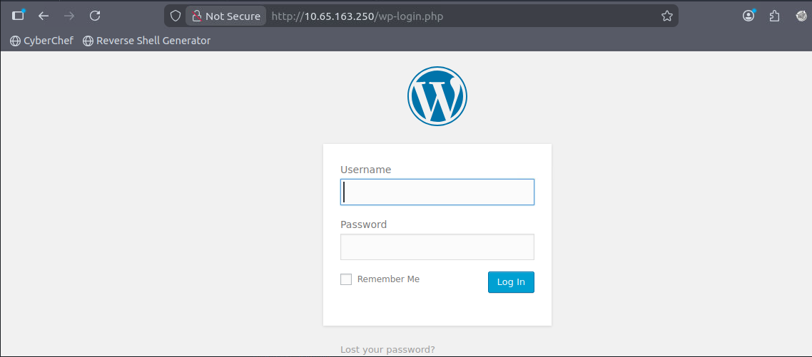

Trying to log in immediately returned an error stating that the username I entered was invalid.

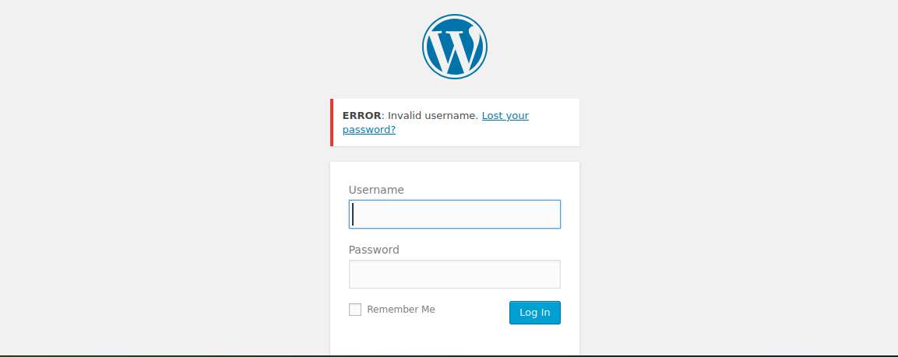

Seeing the `“Invalid username”` message told me something important:        
If the username were correct, the error would likely change. That meant the login form was vulnerable to username enumeration, which opened the door to brute‑forcing valid usernames and, later, passwords.

Conveniently, `FoxyProxy` was already configured for `Burp Suite`, so the next step was to intercept the login request.

With Burp open, I enabled `Proxy → Intercept` and submitted a bogus login attempt on the WordPress page.

This captured the request parameters:

```bash
log=teste&pwd=teste
```

These fields are exactly what `Hydra` needs to build its brute‑force requests.

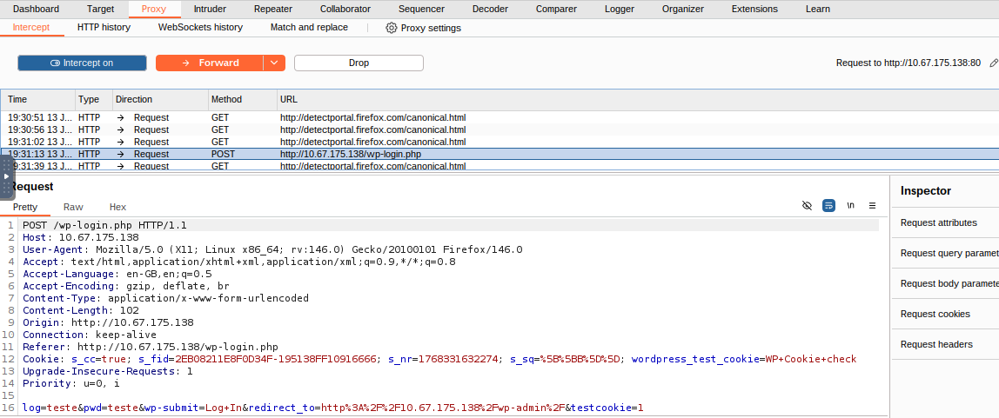

#### Exploitation

With the request structure identified, I moved on to `Hydra`.

My goal here was to brute‑force usernames first, so I used the cleaned `sorted.dic` wordlist and kept the password fixed as a placeholder. I also used the website’s error message as the failure condition.

The final command looked like this:

```bash
hydra -L sorted.dic -p teste <Target IP> http-post-form "/wp-login.php:log=^USER^&pwd=^PASS^:F=Invalid username"
```

Using this approach, `Hydra` identified three very similar usernames: elliot, Elliot, and ELLIOT. I already had credentials for the lowercase version, so the other two were the interesting ones.

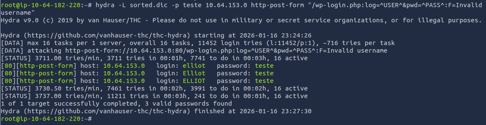

Entering one of the valid usernames on the login page produced a different error message.

And just like that I got a new failure condition that `Hydra` could use to brute‑force passwords for a specific user.


With that information, I built the next `Hydra` command:

```bash
hydra -l ELLIOT -P sorted.dic <Target IP> http-post-form "/wp-login.php:log=^USER^&pwd=^PASS^:F=The password you entered"
```

And ELLIOT's password was recovered.

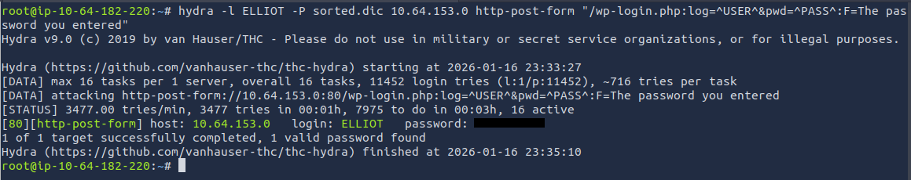

With valid credentials, I logged into the WordPress dashboard. The site was noticeably slow, but after some patience I was able to navigate through the interface and locate the area needed for the next step.

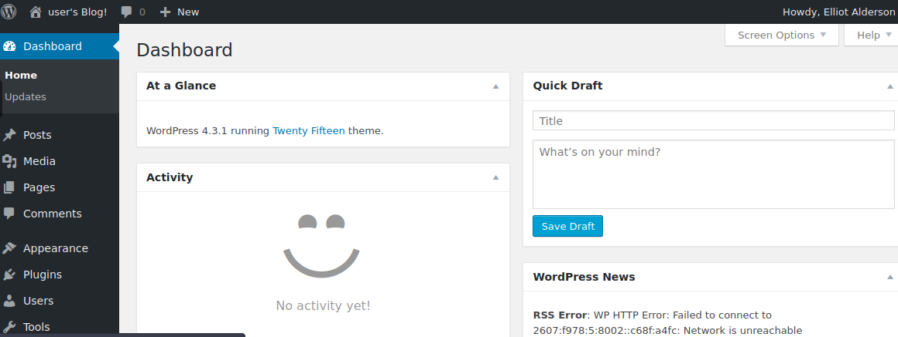

The ELLIOT account had administrator privileges, which allowed access to the theme editor. Using this, I opened the `404.php` template and replaced its contents with a modified version of PentestMonkey’s PHP reverse shell.

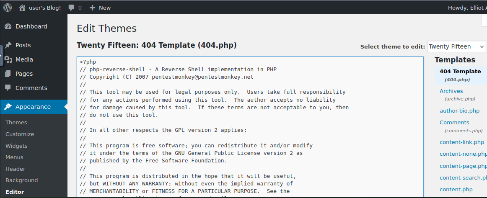

After saving the file, I simply visited any non‑existent page on the target, and my listener, which I had already set up, immediately caught the connection and dropped me into a shell as the user daemon.

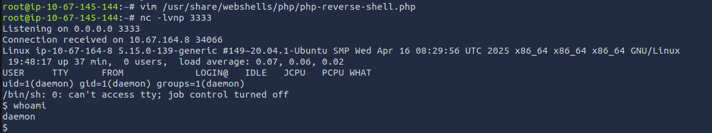

#### Post-Exploitation

With a foothold established, I started poking around the filesystem.        
Inside `/home/robot`, I found the second flag along with a file that looked very much like an MD5‑hashed password belonging to the robot user.

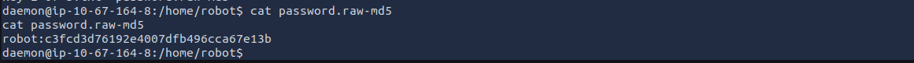

I copied the hash to my clipboard and echoed it into a file that I named `hash.txt` on my attack machine.       
However, I accidentally copied it incorrectly and didn’t notice right away.

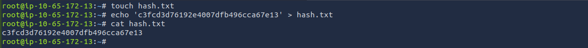

Eventually, I spotted the mistake, corrected the hash, and used `Hashcat` to crack it against the `rockyou.txt` wordlist.

```bash
hashcat -m 0 hash.txt /usr/share/wordlists/rockyou.txt
```

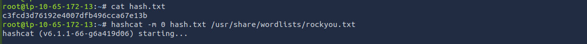       
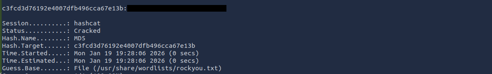

#### Priviledge Escalation

With the cracked password, I switched to the robot user and stabilized the shell using:

```bash
script -qc /bin/bash /dev/null
```

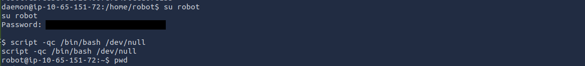

While exploring the system, I eventually asked the room for a hint and received the word `“nmap”`. This reminded me that I hadn’t checked for SUID binaries yet.

To search for SUID binaries, I used:

```bash
find / -perm -u=s -type f 2>/dev/null
```

As expected, the output included `nmap`.

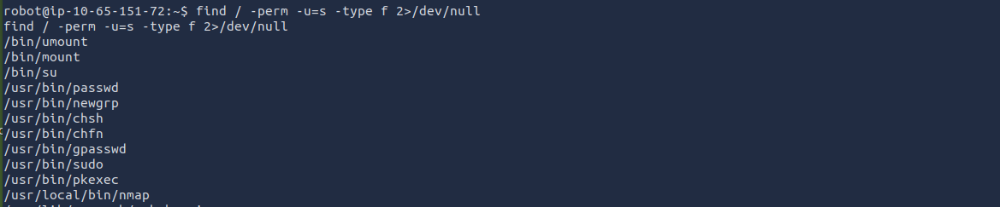

Navigating to its location confirmed that the binary was owned by root and had the SUID bit set.        
This means that whenever nmap is executed, it runs with root permissions.

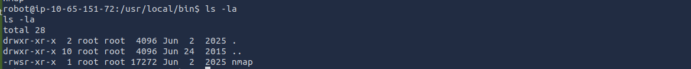

I checked [GTFOBins](https://gtfobins.org/gtfobins/nmap/#shell) for known privilege‑escalation techniques involving nmap and found an entry that allows spawning a shell through its interactive mode.

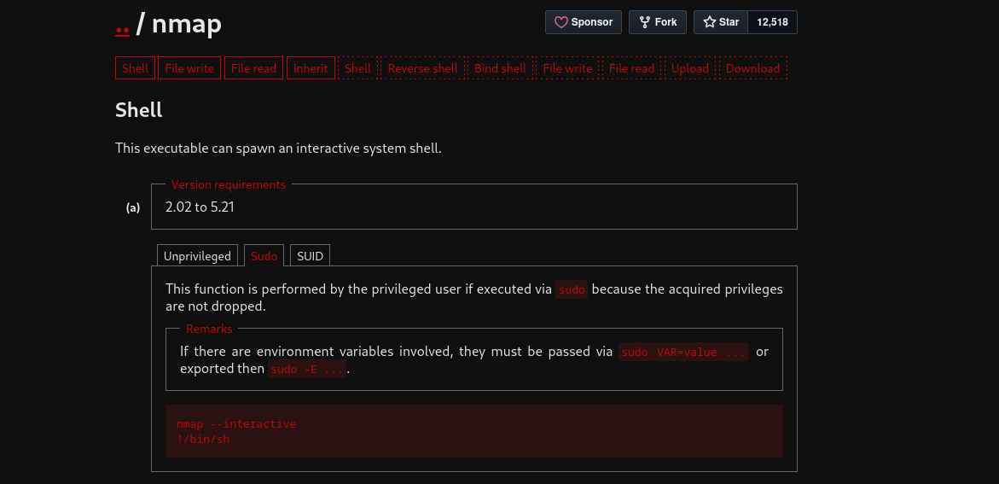

Using the method described there granted me a root shell.

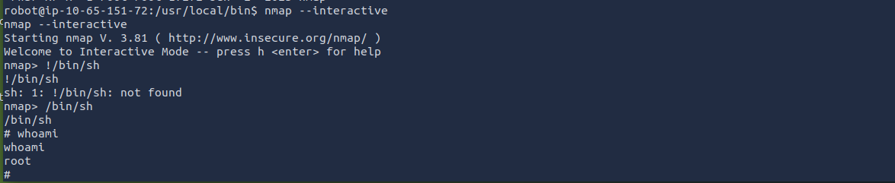

With full root access, I navigated to `/root` and retrieved the final flag.

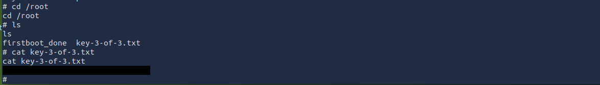


---
