# Room: [Wonderland](https://tryhackme.com/room/wonderland)

## Overview
This write‑up covers the *Wonderland* room on [TryHackMe](https://tryhackme.com), created by [NinjaJc01](https://tryhackme.com/p/NinjaJc01).

The objective of this room is to identify and exploit a web vulnerability to gain an initial foothold on the target machine, followed by privilege escalation to obtain full system access.


## Setup
- **Tools used:** `nmap`,`gobuster`,`gtfobins`
- **Techniques:** `Python module hijacking`,`binary exploitation`
- **Notes:** I originally completed this room a couple months ago, since then I’ve been focused on my job as a pentester.

---

## Methodology

#### Enumeration

I began by running an `nmap` scan against the target to enumerate open ports and gather service/version information.

For full coverage, I scanned all ports and enabled default scripts and version detection using the following command:


```
nmap -sVC &TARGET -p-
```

The results showed two key services exposed: A web server and `SSH`.

Both findings suggested that the initial foothold would likely come from the web application, with `SSH` becoming relevant once valid credentials were obtained.

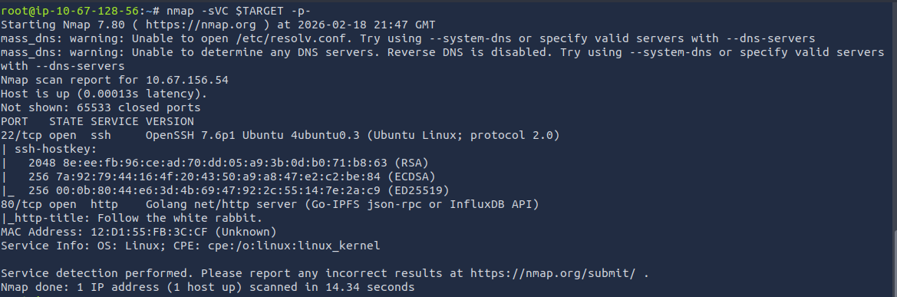

Since the web server was the primary entry point for further enumeration and potential exploitation, I navigated to it first.

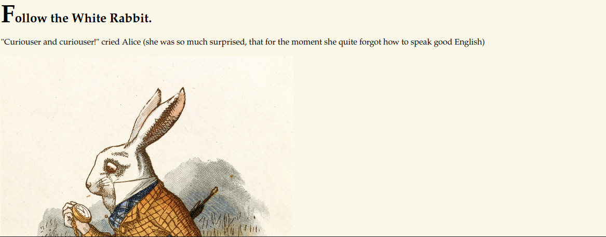

Exploring the main page of the website didn’t reveal anything immediately useful, so I moved on to directory enumeration using `gobuster`.

```
gobuster dir -u $TARGET -w /usr/share/wordlists/dirbuster/directory-list-2.3-medium.txt
```

The scan returned several interesting directories worth investigating.

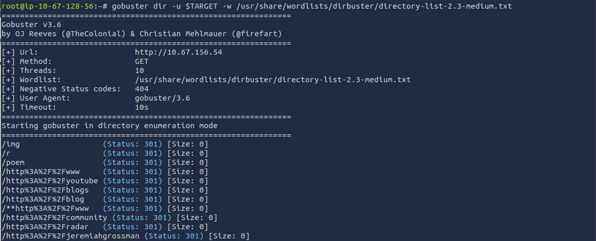        
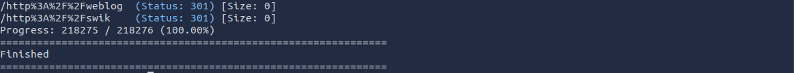

One of the directories discovered by `gobuster` was `/poem`, which displayed the text of Jabberwocky. It didn’t appear to contain any clues relevant to exploitation.

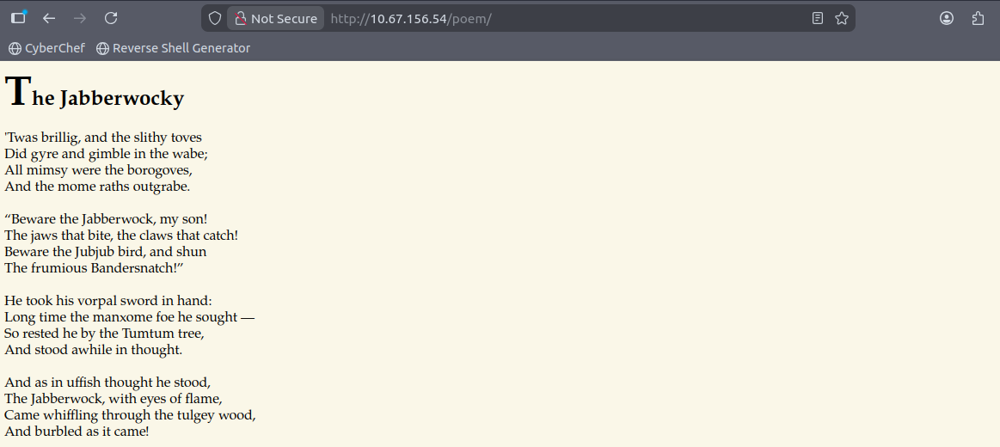     
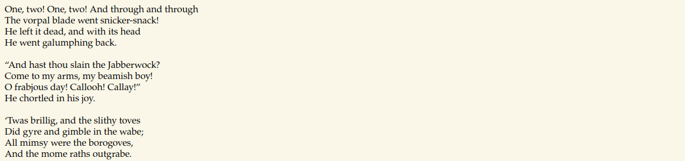

Continuing through the directories discovered earlier, I found another page at `/r`, which simply displayed a message telling me to “keep going.”

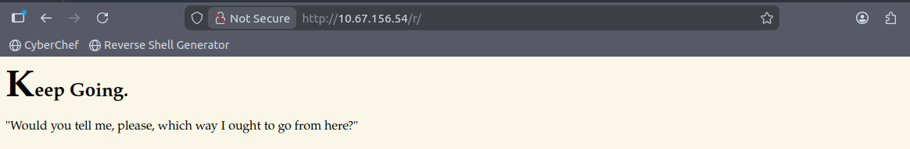

Taking the hint, I ran `gobuster` again, this time targeting the `/r` path.

```
gobuster dir -u $TARGET/r -w /usr/share/wordlists/dirbuster/directory-list-2.3-medium.txt
```

This enumeration revealed the directory `/a`.

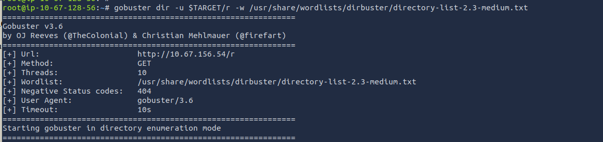      
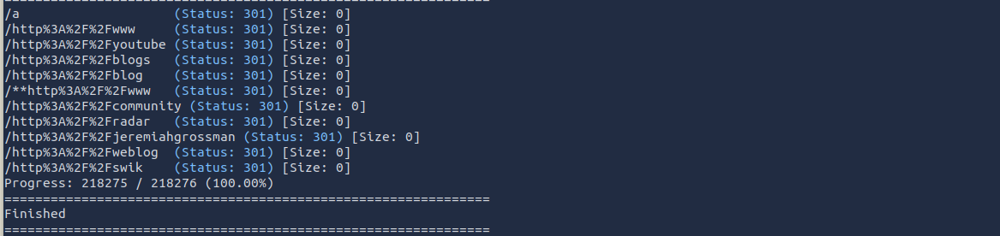

Following the `/r/a` path led to yet another clue, again encouraging me to “keep going”.

The page also included a short excerpt from a conversation between Alice and the Cheshire Cat, fitting the theme but not providing any technical hints.

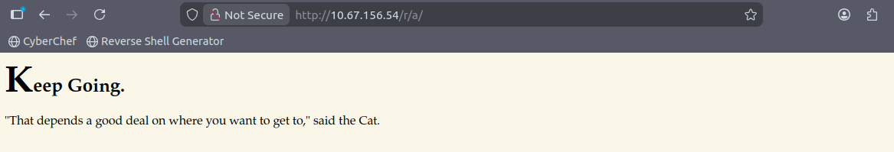

Following the hint on `/r/a`, I continued the pattern by running `gobuster` again.

From this point forward, the process repeated several times, each iteration revealing the next letter in the sequence. Eventually, the full path spelled out `/r/a/b/b/i/t`.

To avoid cluttering the write‑up with meaningless text where I say the same thing over and over, here’s everything I did until getting to `/r/a/b/b/i/t`:

```
gobuster dir -u $TARGET/r/a -w /usr/share/wordlists/dirbuster/directory-list-2.3-medium.txt
```

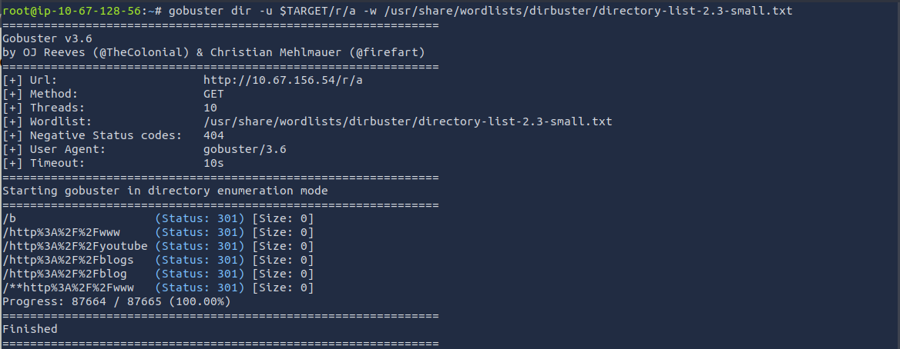       
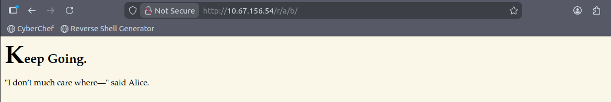

```
gobuster dir -u $TARGET/r/a/b -w /usr/share/wordlists/dirbuster/directory-list-2.3-medium.txt
```

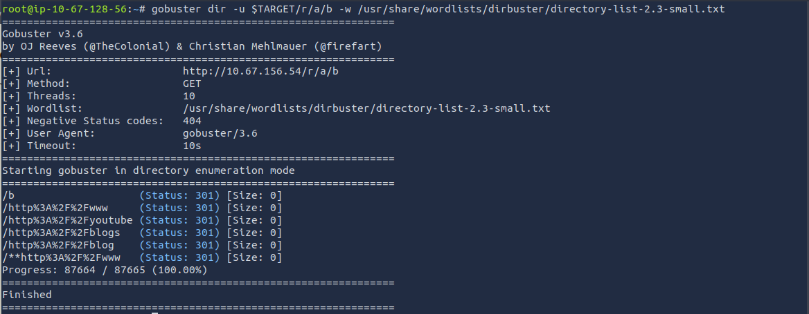     
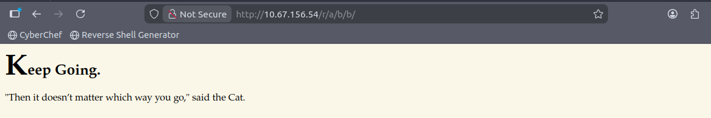

```
gobuster dir -u $TARGET/r/a/b/b -w /usr/share/wordlists/dirbuster/directory-list-2.3-medium.txt
```

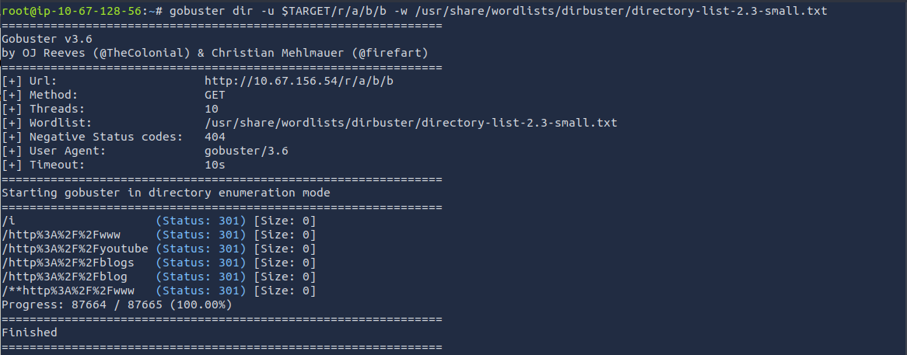       
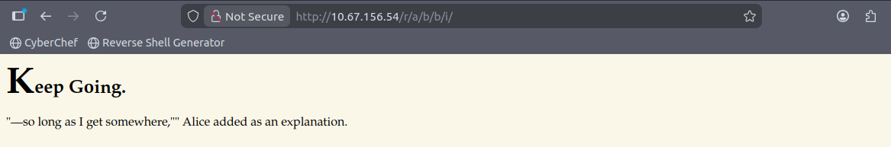

```
gobuster dir -u $TARGET/r/a/b/b/i -w /usr/share/wordlists/dirbuster/directory-list-2.3-medium.txt
```

       
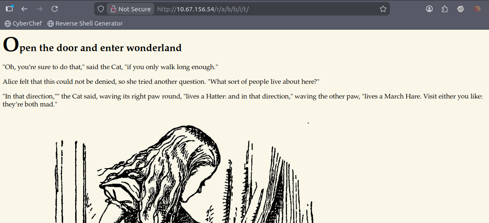

Reaching the final page in the `/r/a/b/b/i/t` chain, I inspected the source code and found hard‑coded credentials for the `alice` user.

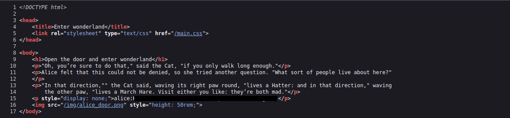

Since the credentials were a bit long and easy to mistype, I saved them in the local file `alice.txt` so I could reference them quickly and easily.

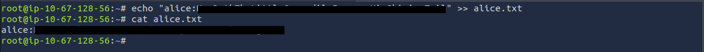

With the recovered credentials saved, I sucessfully logged in as `alice` via `SSH`.

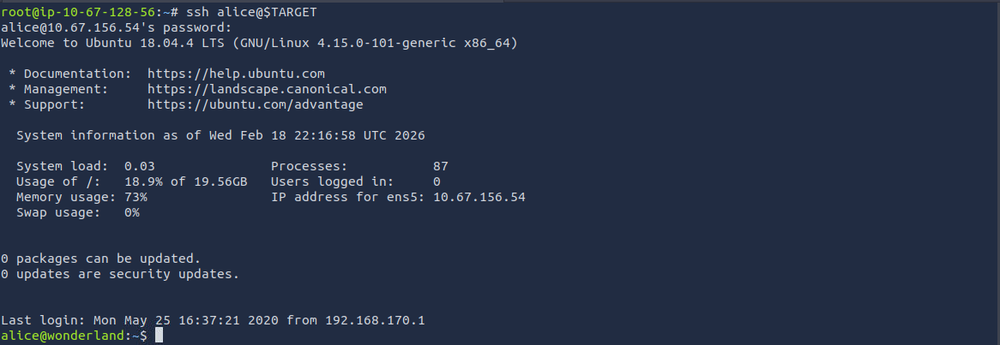

Once inside Alice’s account, I checked for any low‑hanging fruit. 

Listing the contents of their home directory revealed two files: `root.txt` and `walrus_and_the_carpenter.py`.

As expected, I did not have permissions to access `root.txt`.

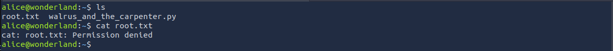

After noticing the room's clue suggesting that “everything is reversed,” I tried looking for `user.txt` in the `/root` directory, and surprisingly, the user flag was located there.

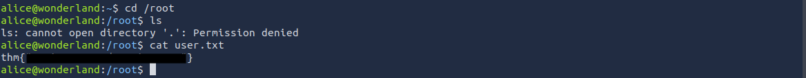

Back in alice’s home directory, I checked their sudo permissions using `sudo -l`.

The output revealed that the user alice is allowed to run the following command as the user `rabbit`, without providing a password:

```
/usr/bin/python3.6 /home/alice/walrus_and_the_carpenter.py
```

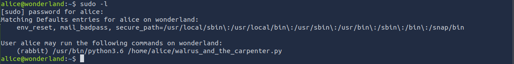

I inspected `walrus_and_the_carpenter.py` in order understand how it behaved when executed.

Turns out that the script’s main purpose is to simply to output a randomly chosen part of the poem each time it ran.

      
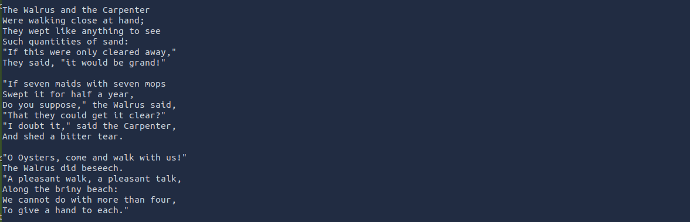      
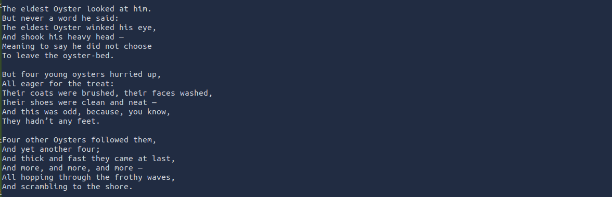      
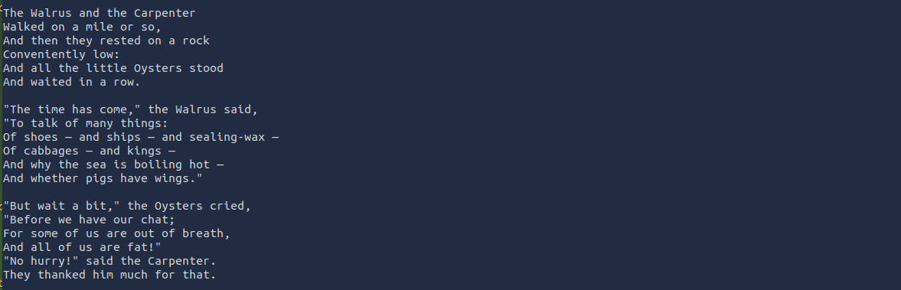      
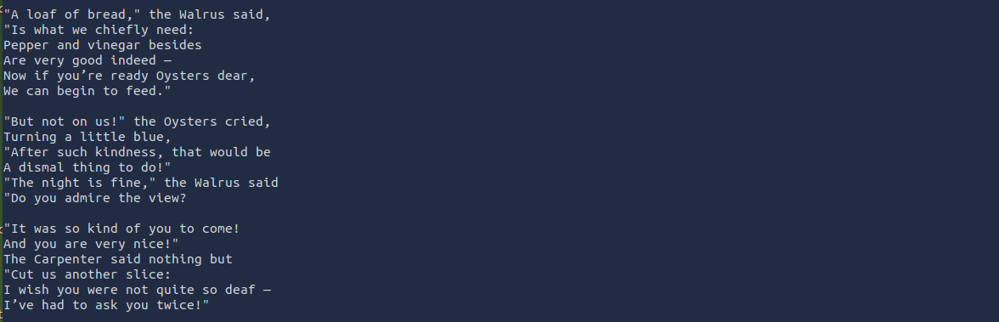      
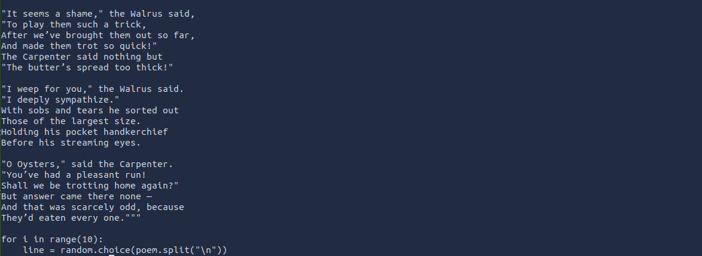      

To escalate from `alice` to `rabbit`, I took advantage of how Python loads modules.        
The script imports the `random` module, and because `alice` is allowed to run this script as `rabbit`, anything the script imports becomes a potential way to execute code with `rabbit’s` privileges.

All I had to do was create my own `random.py` in the same directory. Inside it, I wrote a tiny payload that imports the `os module` and spawns a shell. 

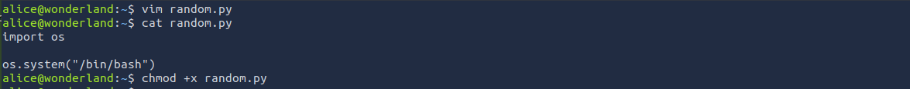

I could then become `rabbit` by simply executing: 
```
sudo -u rabbit /usr/bin/python3.6 /home/alice/walrus_and_the_carpenter.py
```

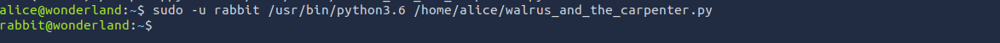

Finally as `rabbit`, i enumerated `/home/rabbit` to see what I could find. The most interesting item there was a binary named `TeaParty`, which belonged to the `hatter` user, suggesting it might be the next escalation point.

Running the binary printed a message saying that the Mad Hatter would arrive in one hour from the moment the program was executed.

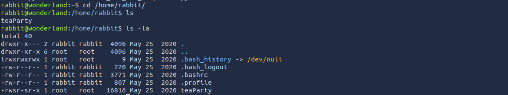

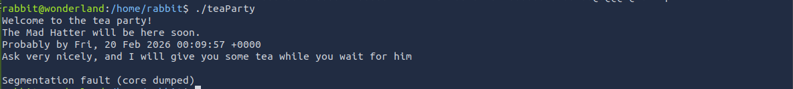

I tried running `strings` on it, but in this case, it didn’t reveal anything useful. This machine did not have strings...

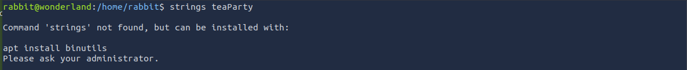

I then tried inspecting it with cat instead. This time, the output was interesting. The binary was actually calling an external system command:

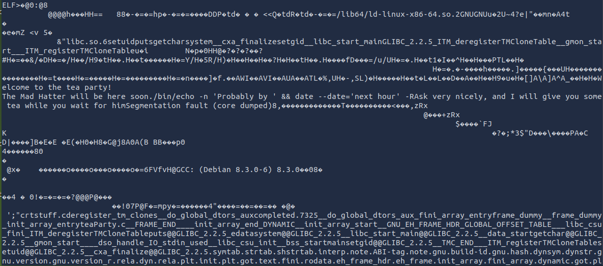

I tested the command on my own machine out of curiosity. It worked exactly the same way.

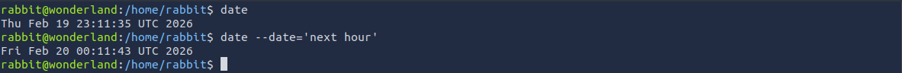

Since the TeaParty binary was calling the date command without using an absolute path, I modified the PATH variable so that `/home/rabbit` appeared at the very beginning.      
That way, if I placed a fake date executable in that directory, the TeaParty binary would run my version instead of the legitimate one.

I exported the modified PATH like this:

```
export $PATH=/home/rabbit:$PATH
```

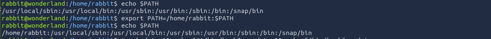

Then a fake date executable was created inside `/home/rabbit`, and to it, I added a small payload that simply launched a shell.

```
touch date && echo '#!/bin/bash' > date && echo '/bin/bash' >> date
```

And finally, gave it execute permission using `chmod +x`.


And just like that, running the `TeaParty` program elevated me from rabbit to hatter.

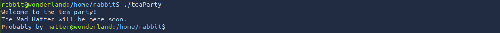

Inside `hatter`´s home directory I found a file named `password.txt`, which contained Hatter’s actual password.         

I did get stuck for a while in this phase but ended up finding the command that would help me find the next vector (`/usr/bin/perl`) and adding it to my notes:

```
getcap -r / 2>/dev/null
```

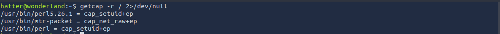

I checked GTFOBins, and looking up perl there showed me a one‑liner that uses Perl’s built‑in functions to set the UID to 0 and then spawn a shell.


Then, I applied it.


And just like that, I became root.

From there, the last step was navigating back to `Alice’s` home directory to retrieve the root flag.

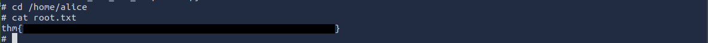

---

